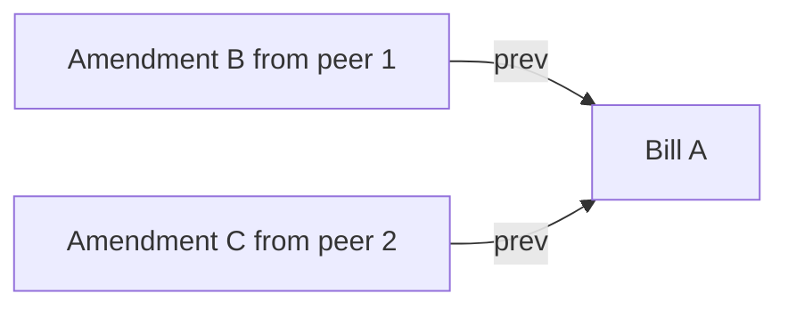

A conflict exists when two or more effective bills share amendment ancestry,
but none supersedes the others.

Detection runs over the full bill list,
not only the effective bill list.
Each bill ID starts as its own Union-Find component.
Every `prev` link unions the successor with its predecessor.

After all links are processed,
the projection collects effective bills and groups them by Union-Find root.
Any component with at least two effective bills is a conflict group.

A conflict group carries both sides of the evidence:
`conflicting` contains the effective competing bills,
and `ancestors` contains the non-effective bills in the same component.

Resolving a conflict creates a new amendment whose `prev` includes every effective bill in the group.
That merge removes the conflict on the next detection pass.

The algorithm is pure and deterministic.
Tests cover no-amendment ledgers, linear amendment chains,
independent amendments, merge resolution, multi-bill `prev`,
and deterministic results regardless of insertion order.
