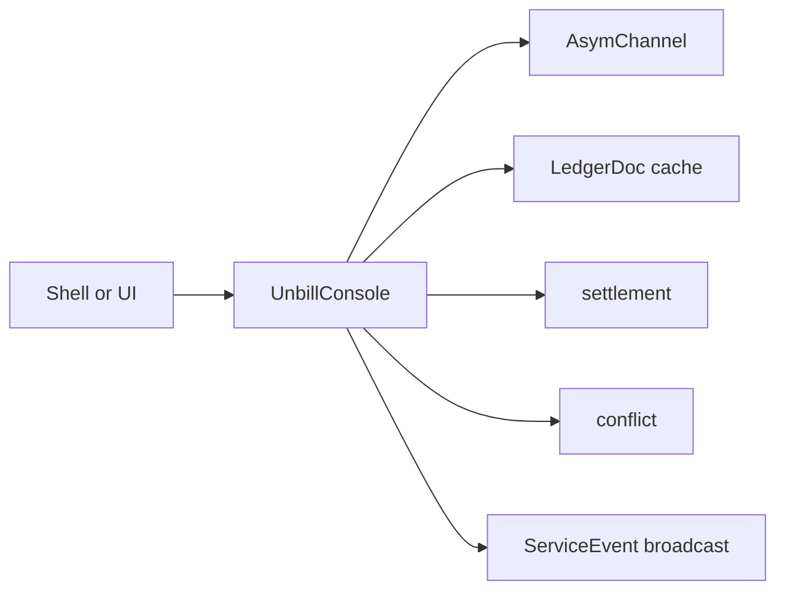

The console service is the public orchestration API for shells.
It creates, loads, and mutates ledgers through the asymmetric channel.
It projects in-memory `LedgerDoc` values for bill and user queries.
It creates invitations,
consumes join flows,
coordinates sync,
computes settlement,
detects conflicts,
and surfaces service events.

`calculate_bill_split` synchronously calculates payer and payee amounts together
without reading or changing a ledger.
The same calculation serves saved bills and unsaved drafts.
Callers supply the total in cents, both lists of positive share weights,
and a bill ID used as the rounding seed.
The method validates the numerical inputs required by the verified splitter,
delegates to `settlement::calculate_bill_split`,
and returns either both allocations or a validation error.
It accepts zero totals; bill submission retains its own validation.
It does not validate ledger membership or bill descriptions.
Repeated calls with the same inputs return the same allocations.
An unsaved draft's rounding seed must remain stable while editing;
its allocation matches a saved bill only when that bill uses the same seed.
The current save operation generates a fresh bill ID.

Opening the service is async.
It primes a mutex-protected map of `LedgerId` to `LedgerDoc`
by syncing every known ledger once.
It then starts an event bridge task that re-syncs the affected ledger
whenever the channel reports `LedgerUpdated`
and re-emits `ServiceEvent::LedgerUpdated` on the console's own broadcast sender
so that subscribing shells and UIs receive the notification.

Most public methods take the target document out of the cache,
perform one typed mutation or query,
sync the document back to the device when mutated,
and return the document to the cache.
Read-only operations also take and put the document so cache ownership stays explicit.

Mutations obtain their timestamp before taking a document from the cache,
then reuse that timestamp when updating ledger metadata.
A system clock error is returned before the mutation starts.

Shells receive user-facing results and events.
They do not receive direct persistence or raw Automerge handles.
