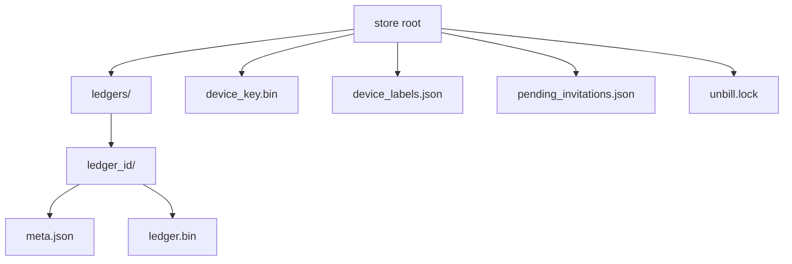

`unbill-store-fs` provides `FsStore`,
the default `LedgerStore` for desktop and server deployments.
It is a newtype around a root path and maps store operations to `tokio::fs`.

The root contains a `ledgers` directory,
one directory per ledger,
`meta.json` for `LedgerMeta`,
`ledger.bin` for Automerge snapshot bytes,
device key material,
device labels,
pending invitations,
and an advisory lock file held for the lifetime of the store.

Desktop platforms, including Mac Catalyst, require the exclusive directory lock.
A second filesystem backend using that directory fails to open until the first store is dropped.
SQLite uses its own database locks and does not participate in this directory lock.
Only Android and non-Catalyst iOS builds skip locking.

Typed label and invitation operations retain the existing JSON files for compatibility.
A per-store async mutex serializes their read-modify-write operations and identity initialization.
There is no public arbitrary-file metadata API.

Writes are atomic.
Data is written to a sibling temporary file and renamed into place.

`list_ledgers` skips directories with missing or invalid metadata and logs a warning.
`create_secret_key` is idempotent and never overwrites an existing key.
The root directory is created on demand.

`MetaJson` mirrors `LedgerMeta` with serialization-friendly primitives.
`UnbillPath` resolves the platform data directory,
including `UNBILL_DATA_DIR` override,
Linux local share defaults,
and macOS Application Support defaults.

Tests use temporary directories.
Coverage includes save, list, load, and device metadata round trips.

Invitation creation generates a fresh token inside the backend; callers cannot resubmit consumed tokens.
Typed metadata mutations emit process-local invalidation events after persistence.
