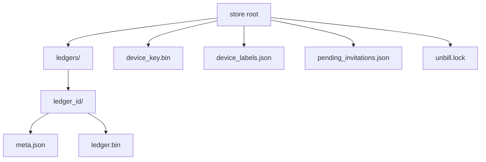

`unbill-store-fs` provides `FsStore`,
the default `LedgerStore` for desktop and server deployments.
It is a newtype around a root path and maps store operations to `tokio::fs`.

The root contains a `ledgers` directory,
one directory per ledger,
`meta.json` for `LedgerMeta`,
`ledger.bin` for Automerge snapshot bytes,
device key material,
device labels,
pending invitations,
and an advisory lock file held for the lifetime of the store.

Writes are atomic.
Data is written to a sibling temporary file and renamed into place.

`list_ledgers` skips directories with missing or invalid metadata and logs a warning.
`create_secret_key` is idempotent and never overwrites an existing key.
The root directory is created on demand.

`MetaJson` mirrors `LedgerMeta` with serialization-friendly primitives.
`UnbillPath` resolves the platform data directory,
including `UNBILL_DATA_DIR` override,
Linux local share defaults,
and macOS Application Support defaults.

Tests use temporary directories.
Coverage includes save, list, load, and device metadata round trips.
