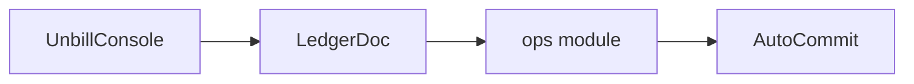

`LedgerDoc` is the Automerge boundary.
It owns an `AutoCommit`,
exposes typed read, write, save, load, and sync operations,
and keeps raw Automerge manipulation out of service and UI layers.

The write path hydrates the typed ledger,
validates input,
mutates the typed value,
and reconciles the full value back into Automerge.
Callers decide when to persist the resulting bytes.

Reads return typed domain values.
Writes reconcile typed ledgers.
Effective bills are a projection over stored bills,
not a separate persisted table.

The lower-level operations module is tested directly against `AutoCommit`
so document behavior can be verified without the service layer.
