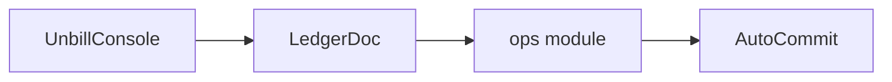

`LedgerDoc` is the Automerge boundary.
It owns an `AutoCommit`,
exposes typed read, write, save, load, and sync operations,
and keeps raw Automerge manipulation out of service and UI layers.

```mermaid
flowchart LR
    Service["UnbillConsole"]
    LedgerDoc["LedgerDoc"]
    Ops["ops module"]
    Automerge["AutoCommit"]

    Service --> LedgerDoc
    LedgerDoc --> Ops
    Ops --> Automerge
```

The write path hydrates the typed ledger,
validates input,
mutates the typed value,
and reconciles the full value back into Automerge.
Callers decide when to persist the resulting bytes.

Reads return typed domain values.
Writes reconcile typed ledgers.
Effective bills are a projection over stored bills,
not a separate persisted table.

`LedgerDoc::state_hash` returns a 32-byte SHA-256 fingerprint of the current
CRDT state. It hashes the concatenated raw 32-byte Automerge change hashes
at the document heads, sorted lexicographically. Reading heads commits any
pending transaction, as the existing heads and save operations do.
An empty document returns SHA-256 of the empty byte sequence.
The fingerprint is stable across save/load and converged replicas,
including concurrent changes and conflicts. It identifies change history,
so independently created documents with identical visible values can differ.
Device-local metadata is outside this fingerprint.

The lower-level operations module is tested directly against `AutoCommit`
so document behavior can be verified without the service layer.
