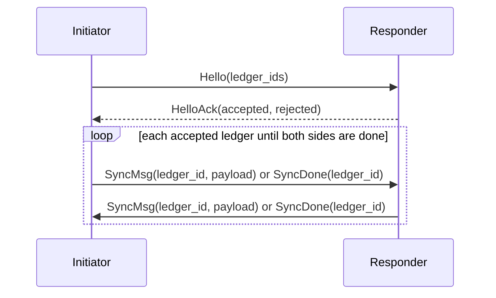
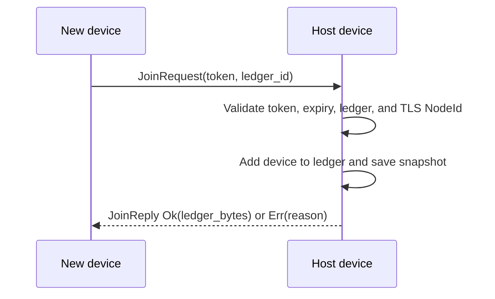

`unbill-symmetric-channel` is the peer-to-peer transport for devices.
All network I/O goes through Iroh.
Each device is identified by its `NodeId`.

The `unbill/sync/v1` protocol lets authorized peers exchange ledger lists
and Automerge sync messages.
The `unbill/join/v1` protocol lets an invite token authorize a new device,
append its `NodeId` to the ledger,
and return a full snapshot.

Discovery comes from known `NodeId` values in ledgers or invite URLs.
Authorization is ledger-scoped and based on TLS-authenticated `NodeId`.
Protocols use length-prefixed CBOR framing.
Sync state is session-local and is not persisted between connections.

`run_sync_session` returns changed ledger documents to the caller.
The caller is responsible for saving them through the store,
which emits `LedgerUpdated`.
The channel layer does not carry an event parameter.

Implementation layout:
`protocol.rs` owns ALPN constants, CBOR frame types, and framing helpers.
`sync.rs` owns the Automerge sync loop over abstract async streams.
`join.rs` owns host and requester join flows over abstract streams.
`endpoint.rs` wraps `iroh::Endpoint`,
binds with the device secret key,
and dispatches incoming connections by ALPN.
`node_id_ext.rs` converts between Unbill model types and Iroh types.

Tests use in-process streams rather than real network endpoints.
Coverage includes framing, convergence, authorization filtering,
and join success and failure paths.
