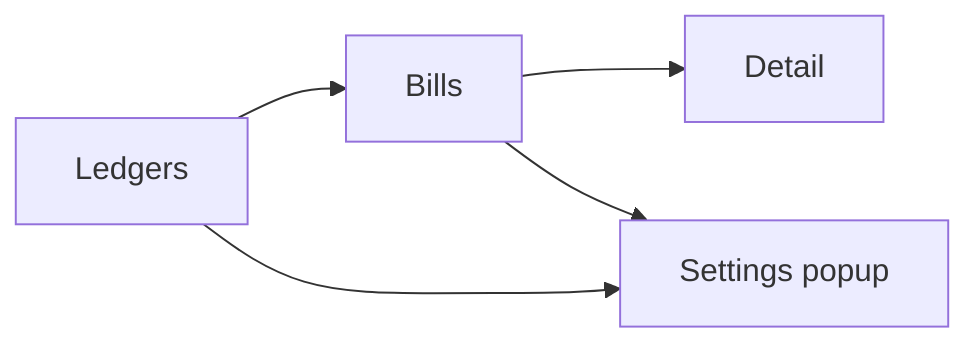

The shared UI model applies to the native desktop UI and the TUI.
The same screen model also shapes the remote browser UI.
Implementations differ by input method and rendering technology.

The main route is ledgers, bills, and detail.
Settings opens as an overlay from ledgers or bills.
Compact mode shows one screen at a time.
Ranger mode shows ledgers, bills, and detail in adjacent columns.
Selection is page state and does not mutate shared data.

The ledgers screen is the app entry point.
It lists ledgers on the current device and provides create-ledger.
Ledgers are sorted by latest bill timestamp descending,
with empty ledgers after active ledgers and name order as tie-breaker.
Selecting a ledger changes page context only.

The bills screen shows effective bills, amendment conflict groups, and settlement.
Conflict groups render before settlement.
Each group exposes all effective competing bills so the operator can compare them.
Resolving a conflict is two steps:
choose the bill version to keep,
then commit that choice for the group.
The commit creates a merge amendment that preserves selected bill fields
and supersedes every competing effective bill.

Settlement is shown inline under the bill list as minimum transfers to clear balances.
Bill editing opens from selected bill context.
Ledger settings opens with the current ledger preselected.
Back from bills clears the active ledger selection.

The detail screen handles new-bill and amend flows.
It sends complete bill-save commands through the boundary.
It owns local form behavior only:
amount parsing,
share preview,
share mode handling,
raw draft input,
and save-time validation feedback.
New bills seed from ledger users with equal shares.
Amend mode seeds from the selected bill and preserves its effective participant set.
Payers and payees use positive integer share weights with live per-participant amount preview.

The settings popup has Device Settings and Ledger Settings tabs.
Opening from device controls activates Device Settings.
Opening from a ledger activates Ledger Settings and preselects that ledger.
The popup always allows switching tabs.
Compact mode uses a full-screen overlay.
Ranger mode floats above the columns.

Device Settings owns local-only device concerns:
device ID display,
known peer devices,
peer sync actions,
and join-ledger actions.
Join accepts an inbound `unbill://join/...` URL.
Clipboard prefill is only a convenience;
manual invitation entry must remain available when clipboard access fails.

Ledger Settings owns ledger-scoped users and invitations.
It provides a ledger selector,
renders users and authorized peer devices for the selected ledger,
offers sync actions for those peers,
adds users from all users known on this device or by creating a new named user,
and keeps generated invitation URLs in popup state.

Frontends render backend DTOs and send complete commands.
Conflict detection, settlement, projection, and persistence are backend responsibilities.
Dates render in the viewer's local calendar as zero-padded year, month, day, hour, and minute.
Status, busy, and error feedback are shared across the shell.
Mutating actions refresh bootstrap state,
and ledger-scoped actions refresh selected ledger detail when that detail could have changed.
