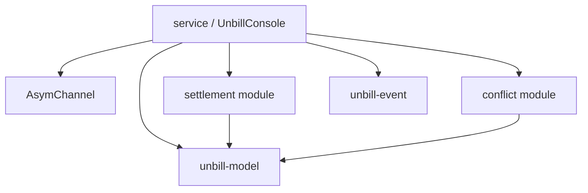

`unbill-console` is the console-side library.
It drives an `AsymChannel`,
keeps an in-process ledger projection,
computes settlement,
detects amendment conflicts,
and exposes user-facing service results.

`service/` is the public entry point through `UnbillConsole`.
Persistent operations are delegated to the asymmetric channel.
The console holds no durable ledger state of its own.

`settlement/` and `conflict/` are pure logic modules.
They operate over projected ledger state.

`qr/` generates text and SVG QR codes from invitation URLs
for terminal and browser display.

`storage/` re-exports `LedgerStore` and `StorageResult` from `unbill-storage`
for test scaffolding only (`#[cfg(test)]`).

`net/` re-exports symmetric channel endpoint and protocol helpers unconditionally.

Both modules are convenience surfaces.
The durable storage design lives in `unbill-storage`,
and the durable networking design lives in `unbill-symmetric-channel`.

The crate preserves core invariants:
IDs stay typed and opaque,
ledger currency is fixed at creation,
bills are append-only,
bill participants must already exist in the ledger,
devices authorize sync per ledger,
device addition is idempotent,
and local metadata remains outside shared ledger state.

The crate does not own CLI parsing, Tauri wiring, or UI state.
Storage and transport are abstracted behind the asymmetric channel.
