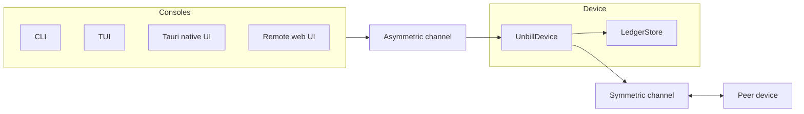

Unbill is offline-first bill splitting for small trusted groups.
Each ledger lives on member devices and syncs peer-to-peer.
There is no hosted source of truth, hosted account system, or telemetry surface.

The app records who paid and who owes whom.
It does not move money.

Unbill is meant for households, trips, couples, and similar groups that already trust each other.
The system stores data where that trust already lives:
on the devices of the people who share the ledger.

The project is intentionally narrow.
It is shared expense tracking, not a payment network, bank integration layer,
general accounting package, or product for hostile or anonymous groups.

The codebase is organized around a Rust core split across domain, storage, device,
console, channel, and UI crates.
Applications and shells adapt that core to terminal, desktop, browser, daemon, and server forms.

The system view is device-centered.
Consoles send requests through an asymmetric channel,
the device persists ledger state,
and peer devices converge through the symmetric channel.

