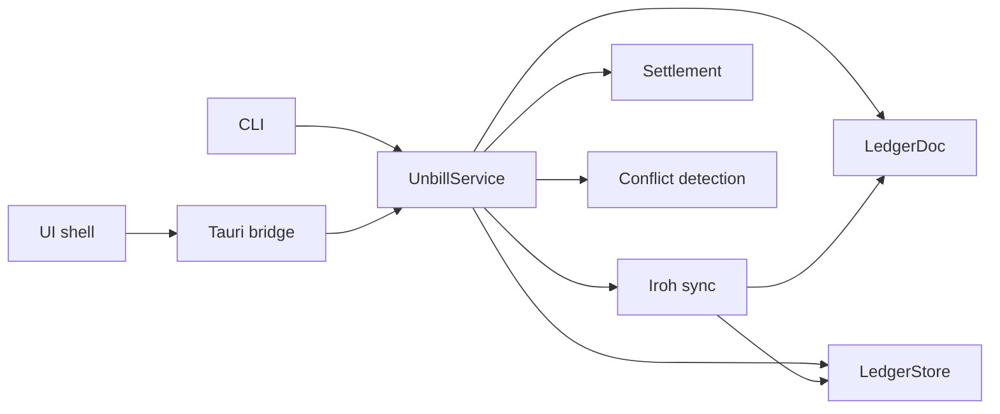
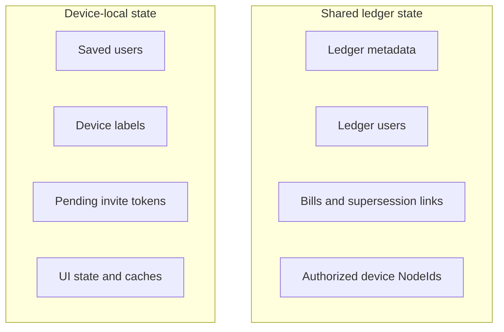
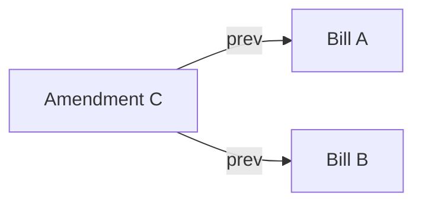
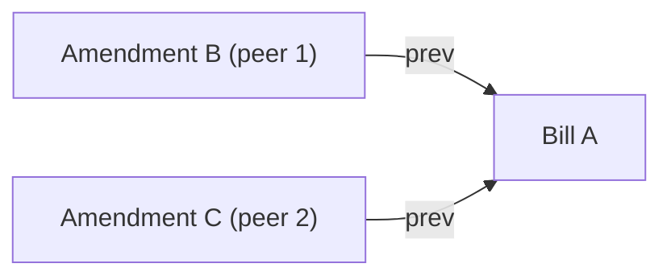

# Unbill

Unbill is a decentralized expense ledger for small trusted groups. Each ledger is stored on member devices and syncs peer-to-peer. No server or account system owns the data.

## Purpose

The project exists to make shared expense tracking durable without requiring a hosted service. A ledger should remain usable when a device is offline, when one participant is temporarily unavailable, and when there is no central operator coordinating state. The system is meant for groups that already trust each other enough to share a bill log and reconcile payments outside the app.

The design favors a small number of concepts that compose cleanly: ledgers, users, devices, bills, and projections derived from those records. The aim is for the whole system to stay understandable from the model upward.

## System View

The codebase is organized around one domain engine and several adapters. Shells ask the service to perform work. The service loads or saves ledger state, coordinates sync, and returns typed results. No shell owns its own version of bill logic, projection, or settlement.

## Core model

- `Ledger` — an independent shared workspace with a fixed currency
- `User` — a named person inside a ledger; append-only
- `Device` — an authorized sync peer identified by `NodeId`; append-only and ledger-scoped
- `Bill` — an expense entry with payer shares, payee shares, amount, and optional `prev` links to superseded bills
- effective bills — bills not named by another bill's `prev`
- invitation tokens — short-lived values used for device join or saved-user transfer; not part of shared ledger state

The shared ledger stores only durable collaborative state. Local preferences and convenience data stay outside it so peers do not have to converge on UI choices or machine-specific metadata.

## Shared And Local State

This split is one of the key design choices in unbill. Shared state is the minimum durable record required for peers to agree on a ledger. Local state exists to make one device usable and is never treated as part of the replicated document.

## Principles

- Offline first. Local work never depends on network availability.
- Core first. The Rust core defines model, storage, sync, and settlement; shells stay thin.
- CRDTs over consensus. State is derived from observed operations rather than from a single authoritative device.
- Append-only shared state. Users, devices, and bills are added rather than edited in place.
- Deterministic projection. The UI renders derived state from the shared log.
- Narrow trust model. v1 assumes honest members of a small group.

These principles keep the codebase biased toward recoverable, mergeable state. If a device falls behind, reconnects later, or uses a different shell, the result should still be the same effective ledger.

## Why The Model Looks This Way

Users and devices are separate because people and hardware do not map one-to-one. A person may use many devices, and a shared device may be used by more than one person. Authorization therefore happens at the device level, while bill semantics reference users.

Bills are append-only because shared editing is simpler when old records remain part of the log. A correction becomes a new bill that supersedes an older one through `prev`. The visible ledger is therefore a projection over durable history rather than a mutable table with in-place updates.

Weighted shares give one split representation for equal and uneven splits. That keeps the storage and settlement model small while still covering the common cases.

## Bill Supersession

The effective view contains bills whose IDs are not referenced by another bill's `prev`. That allows one bill to replace one earlier bill or merge several earlier bills into a single successor while keeping the underlying history intact.

## Conflict Detection

Because two peers may independently amend the same bill without knowing about each other, the effective bill set can contain a conflict: multiple effective bills that share a common ancestry but none of which supersedes the others.

After sync, A is superseded and both B and C are effective. They are in conflict because neither is named in the other's `prev`.

Conflict detection uses a Union-Find over all bill IDs. Every `prev` link unions the successor with its predecessor. After all links are processed, any two effective bills that share the same root are in conflict. A `ConflictGroup` represents one such set of effective bills.

A conflict is resolved by creating a new amendment bill whose `prev` includes every effective bill in the group, merging the competing branches into a single successor.

## Boundaries

- unbill records obligations but does not move money.
- Synced state excludes UI state, caches, device labels, and other local metadata.
- Devices are authorized per ledger and are not bound to specific users.
- Saved users are device-local records; ledger users are shared ledger records.
- unbill has no telemetry, analytics, hosted account system, or server-backed authority model

The system also avoids a server-backed recovery or authority model. Sync helps peers converge, but no peer becomes the permanent owner of a ledger once others have a copy.

## Architecture View

The repository is organized around one core engine and several thin shells. `unbill-core` owns the model and rules. The CLI, Tauri bridge, and UI applications adapt that core to different environments. This keeps business logic in one place and makes the system easier to reason about, test, and evolve.

## Security

Transport uses Iroh over QUIC/TLS with `NodeId` identity. Authorization is based on membership in the ledger's device list.

Outbound network traffic is limited to peer discovery, relay fallback, and direct sync traffic. The design does not include analytics beacons, hosted coordination services, or default update checks.

The threat model is intentionally modest. v1 aims to prevent accidental cross-ledger access and trivial impersonation on the wire, not to defend against malicious insiders, compromised devices, revocation problems, or relay metadata leakage. Groups that need stronger guarantees are outside the current design target.
