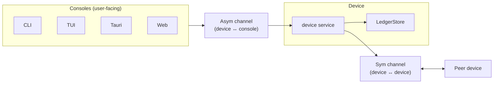
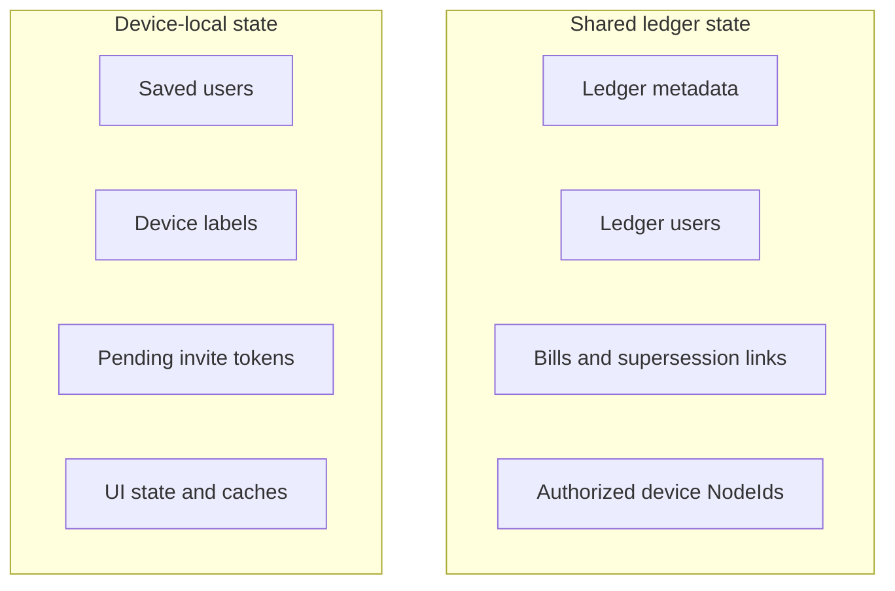
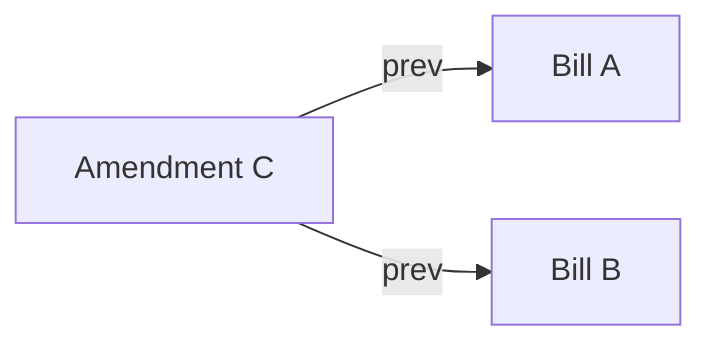
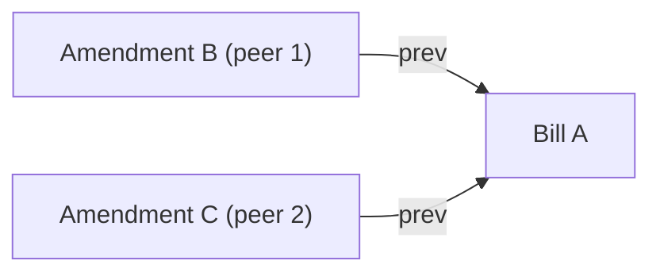

# Unbill

Unbill is a decentralized expense ledger for small trusted groups. Each ledger is stored on member devices and syncs peer-to-peer. No server, hosted account system, or central authority owns the data.

## Why this design

### P2P rather than server-hosted

Ledger applications today require a central server that holds every user's account data. This model carries costs that do not disappear: the operator can read all ledgers, must be trusted to never go down or lose data, and decides who can use the service. For a friend or family ledger, none of these costs buy anything meaningful — the data is already shared among a small trusted circle. Unbill stores data where the trust already lives: on the devices of the people who share the ledger.

### CRDTs for convergence

A P2P ledger must reconcile concurrent edits from multiple devices, often after long offline periods. Unbill uses Automerge so that convergence under arbitrary network conditions is a data structure property rather than a feature to engineer per operation.

### Device / console separation

Compressing storage and display into a single role means every UI carries a full replica of state. This breaks quickly when multiple UIs run on the same machine or when the ledger needs to be accessed remotely. Unbill separates **device** (storage + sync) from **console** (display + interaction) to unlock deployment flexibility:

- The same machine can run a Tauri app, a TUI, and a browser frontend simultaneously, all viewing the same data
- A remote web console can connect to a device at home without a local UI being open
- Switching form factor (desktop to phone) is transparent to background sync
- A shared family device can host consoles from every family member at once

### Two kinds of channels

Device-to-device sync is symmetric state exchange. Device-to-console interaction is request/response plus subscription, and also carries control operations. Unbill separates them so each channel is exactly as complex as its job requires.

### Amend instead of mutation

CRDT merge is correct as an algorithm but often wrong as a business semantic. When two peers independently change the same bill, neither result may reflect the intent. Unbill makes the bill list append-only and expresses modifications as new bills pointing to old ones. Concurrent modifications become visible conflicts, and merging is a human decision encoded as a merging bill. The algorithm guarantees state convergence; humans decide what the state should mean.

### Peer-equal trust

For friend / family ledgers, participants are not mutually suspicious. The actual threat model is "what if a stranger gets in," not "what if Alice secretly changes Bob's bill." Unbill establishes trust once at invite-acceptance time and treats all members as equally privileged thereafter.

### One Rust codebase across platforms

The Rust + WASM + Tauri + Leptos stack lets unbill share the console logic, UI code, and data model as one codebase that compiles to every target. Platform reach is achieved by leverage, not headcount.

## System view


```mermaid
flowchart LR
    subgraph Consoles["Consoles (user-facing)"]
        CLI["CLI"]
        TUI["TUI"]
        Tauri["Tauri"]
        Web["Web"]
    end

    AsymCh["Asym channel\n(device ↔ console)"]

    subgraph DeviceNode["Device"]
        Service["device service"]
        Store["LedgerStore"]
        Service --> Store
    end

    SymCh["Sym channel\n(device ↔ device)"]
    Peer["Peer device"]

    Consoles --> AsymCh
    AsymCh --> Service
    Service --> SymCh
    SymCh <--> Peer
```

Consoles ask the device to perform work through the asym channel. The device persists ledger state, runs the sym channel sync loop, and broadcasts events back to connected consoles.

## Channels

### Symmetric channel (sym channel)

Occurs between **device ↔ device**. Both ends are peers, each holding complete CRDT state. Single responsibility: converge CRDT state on both sides — pure data plane.

### Asymmetric channel (asym channel)

Occurs between **device ↔ console**. The device is the source of truth; the console is its projection and an entry point for operations. Carries two planes:

- **Data plane** — the console syncs ledger state (Automerge rounds) and subscribes to change events
- **Control plane** — creating ledgers, generating and accepting invites, managing peers, triggering sym sync

A single device can host asym channels for multiple consoles concurrently.

## Core model

- `Ledger` — an independent shared workspace with a fixed currency
- `User` — a named person inside a ledger; append-only
- `Device` — an authorized sync peer identified by `NodeId`; append-only and ledger-scoped
- `Bill` — an expense entry with payer shares, payee shares, amount, and optional `prev` links to superseded bills
- effective bills — bills not named by another bill's `prev`
- invitation tokens — short-lived values used for device join; not part of shared ledger state

The shared ledger stores only durable collaborative state. Local preferences and convenience data stay outside it so peers do not have to converge on UI choices or machine-specific metadata.

## Users vs. devices

Users and devices are separate because people and hardware do not map one-to-one. A person may use many devices, and a shared device may be used by more than one person. Authorization therefore happens at the device level while bill semantics reference users.

A user is purely a ledger-internal accounting dimension, independent of device or login identity. Any member can operate any user. Multiple users may represent the same real person, or one user may be shared by multiple real people. This flexibility fits the friend / family ledger positioning.

## Shared and local state


```mermaid
flowchart TB
    subgraph Shared["Shared ledger state"]
        Ledger["Ledger metadata"]
        Users["Ledger users"]
        Bills["Bills and supersession links"]
        Devices["Authorized device NodeIds"]
    end

    subgraph Local["Device-local state"]
        LocalUsers["Saved users"]
        Labels["Device labels"]
        Pending["Pending invite tokens"]
        Ui["UI state and caches"]
    end
```

Shared state is the minimum durable record required for peers to agree on a ledger. Local state exists to make one device usable and is never treated as part of the replicated document.

## Bill supersession


```mermaid
flowchart LR
    B1["Bill A"]
    B2["Bill B"]
    A1["Amendment C"]

    A1 -->|"prev"| B1
    A1 -->|"prev"| B2
```

The effective view contains bills whose IDs are not referenced by another bill's `prev`. That allows one bill to replace one earlier bill or merge several earlier bills into a single successor while keeping the underlying history intact.

Bills are append-only because shared editing is simpler when old records remain part of the log. A correction becomes a new bill that supersedes an older one through `prev`. The visible ledger is therefore a projection over durable history rather than a mutable table with in-place updates.

## Conflict detection

Because two peers may independently amend the same bill without knowing about each other, the effective bill set can contain a conflict: multiple effective bills that share a common ancestry but none of which supersedes the others.


```mermaid
flowchart LR
    A["Bill A"]
    B["Amendment B (peer 1)"]
    C["Amendment C (peer 2)"]

    B -->|"prev"| A
    C -->|"prev"| A
```

After sync, A is superseded and both B and C are effective. They are in conflict because neither is named in the other's `prev`.

Conflict detection uses a Union-Find over all bill IDs. Every `prev` link unions the successor with its predecessor. After all links are processed, any two effective bills that share the same root are in conflict. A `ConflictGroup` represents one such set of effective bills.

A conflict is resolved by creating a new amendment bill whose `prev` includes every effective bill in the group, merging the competing branches into a single successor.

## Sync behavior

Sync is user-initiated. There is no background polling or automatic reconciliation loop. A user or integration tool explicitly requests a sync round; the device then dials the peer over the sym channel and exchanges Automerge messages until both sides converge.

After remote changes are applied, the device saves the updated ledger and emits `LedgerUpdated` so connected consoles can refresh.

## Event propagation

Data flows from device to UI in two hops:

```
device ──[asym channel]──► console ──[host-specific mechanism]──► UI
```

**First hop** (device → console): the asym channel delivers `LedgerUpdated` events to the console. The console responds by pulling a fresh asym sync round.

**Second hop** (console → UI): the console translates CRDT changes into materialized views and exposes them through a `ServiceEvent` broadcast. The UI always sees usable views; CRDT details are absorbed by the console.

## Deployment topologies

### Single-process colocated

Inside a mobile app, a device and a console coexist as two tasks within the same process. The asym channel is in-process memory communication (`LocalAsymChannel`). This fits the sandbox model of mobile platforms.

### Local two-process (desktop standard)

The device runs as a standalone daemon (`unbill-daemon`) in the background. CLI, TUI, and Tauri connect as separate processes over a Unix local socket (`RpcAsymChannel`). The daemon continues to maintain sync after the UI is closed. Multiple consoles on the same machine can concurrently connect to the same daemon.

### Remote access

The user runs `unbill-server` on a home server or VPS. Web and other remote consoles connect over HTTP (`HttpAsymChannel`).

### Multiple devices

A user may own multiple devices simultaneously (laptop + VPS + phone), all connected to one another via sym channels. This is a primary target scenario for unbill's design.

## Architecture view

The repository is organized around two roles — **device** and **console** — connected by channels. Each role and each channel has its own crate.

- `unbill-device` — device-side service: owns the ledger store and sym channel endpoint; `UnbillDevice` is the plain struct that asym channel implementations wrap or call directly
- `unbill-console` — console-side library: drives an `AsymChannel`, projects CRDT state, computes settlement, and detects conflicts
- `unbill-asymmetric-channel` — the `AsymChannel` trait and its concrete implementations (`LocalAsymChannel`, `RpcAsymChannel`, `HttpAsymChannel`)
- `unbill-symmetric-channel` — device-to-device Iroh transport, sync and join protocols
- `unbill-storage` / `unbill-store-*` — `LedgerStore` trait and its backends
- `unbill-model` — shared domain types with no logic
- `unbill-event` — event types for service broadcasts
- `unbill-tauri`, `unbill-ui-components` — Tauri bridge and shared Leptos UI components

Applications: `unbill-cli`, `unbill-tui`, `unbill-daemon`, `unbill-server`, `unbill-ui-native`, `unbill-ui-remote`.

## Principles

- **Offline first** — local work never depends on network availability
- **Device / console split** — the device owns storage and sync; the console owns display and user interaction; they communicate through the asym channel
- **CRDTs over consensus** — state is derived from observed operations rather than from a single authoritative device
- **Append-only shared state** — users, devices, and bills are added rather than edited in place
- **Deterministic projection** — the UI renders derived state from the shared log
- **Narrow trust model** — all joined members are treated as equally trusted
- **Roles over identities** — user is a labeling dimension inside a ledger, decoupled from login identity
- **State over provenance** — the ledger records "what happened"; "who did it" is carried by social context

## Security

Transport uses Iroh over QUIC/TLS with `NodeId` identity. Authorization is based on membership in the ledger's device list.

Outbound network traffic is limited to peer discovery, relay fallback, and direct sync traffic. The design does not include analytics beacons, hosted coordination services, or default update checks.

The threat model is intentionally modest. v1 aims to prevent accidental cross-ledger access and trivial impersonation on the wire, not to defend against malicious insiders, compromised devices, revocation problems, or relay metadata leakage. Groups that need stronger guarantees are outside the current design target.

## Boundaries

- unbill records obligations but does not move money
- synced state excludes UI state, caches, device labels, and other local metadata
- devices are authorized per ledger and are not bound to specific users
- saved users are device-local records; ledger users are shared ledger records
- unbill has no telemetry, analytics, hosted account system, or server-backed authority model
- no peer becomes the permanent owner of a ledger once others have a copy

## Glossary

| Term | Meaning |
|---|---|
| Device | A full P2P participant; persists CRDT state and holds a `NodeId` |
| Console | A user-facing surface that operates a device; holds only transient state |
| Channel | The abstraction of a communication relationship |
| Sym channel | The communication relationship between two devices |
| Asym channel | The communication relationship between a device and a console |
| Ledger | An independent account book, an Automerge document at its core |
| User | A ledger-internal accounting dimension; a role label independent of technical identity |
| Bill | A single accounting record in a ledger; append-only |
| Amend | Expressing a modification by appending a new bill that points to an older one |
| Amending bill | A new bill that amends an older bill |
| Merging bill | A bill that simultaneously amends multiple conflicting versions, created by the user |
| Invite | A one-time credential for joining a ledger |
| NodeId | A device's Ed25519 public key identity |
