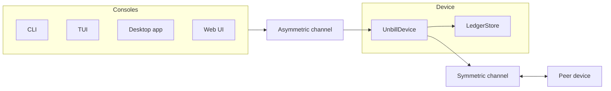

# Unbill

<!-- Compiled from unbill-docs. Update the Sirno lake first, then refresh this artifact. -->

<p align="center">
  
</p>

<p align="center">
  <strong>Offline-first bill splitting for small trusted groups.</strong>
</p>

<p align="center">
  <a href="https://github.com/unbill-project/unbill/actions/workflows/ci.yml"></a>
  <a href="https://github.com/unbill-project/unbill/releases/latest"></a>
  <a href="LICENSE"></a>
</p>

______________________________________________________________________

<!-- sirno:witness:unbill:begin -->

Unbill keeps shared expense ledgers on member devices and syncs them peer-to-peer.
There is no hosted source of truth,
hosted account system,
or telemetry surface.
The app records who paid and who owes whom.
It does not move money.

Unbill is meant for households, trips, couples,
and other small groups that already trust each other.
It is not a payment network,
bank integration layer,
general accounting package,
or product for hostile or anonymous groups.

<!-- sirno:witness:unbill:end -->

### Why Unbill

- **Your data stays on your devices.** Ledgers sync directly between group members — no cloud account required.
- **Works offline.** Record expenses without a network. Changes merge automatically when devices reconnect.
- **Runs everywhere.** Desktop app, a native Apple app for iPhone/iPad/Mac, CLI, TUI, Android, and a self-hosted relay server.
- **Open source.** Dual-licensed MIT / Apache-2.0. Inspect, build, and modify freely.

## Install

<!-- sirno:witness:distribution-and-release:begin -->

See **[INSTALL.md](INSTALL.md)** for full per-platform instructions
(macOS, Linux, Windows, iOS, Android, Docker).

Quick examples:

```sh
# macOS — Homebrew
brew install --cask unbill-project/tap/unbill        # desktop app
brew install unbill-project/tap/unbill-cli           # CLI

# Linux — AUR (Arch)
yay -S unbill-cli-bin unbill-tui-bin unbill-daemon-bin

# Nix (any platform)
cachix use unbill
nix profile install github:unbill-project/unbill#unbill-tauri

# Docker (server)
docker pull ghcr.io/unbill-project/unbill-server:latest
```

Prebuilt binaries for all platforms are attached to each
[GitHub release](https://github.com/unbill-project/unbill/releases/latest).

<!-- sirno:witness:distribution-and-release:end -->

## How It Works



Consoles (CLI, TUI, desktop app, the native Apple app, web UI) send requests through an asymmetric channel to the local device.
The device persists ledger state in Automerge documents and converges with peers through the symmetric channel.

## Development

### Build and run

Use Rust stable.

```sh
cargo build --workspace
cargo test --workspace --exclude unbill-tauri
```

Run local tools through Cargo:

```sh
cargo run -p unbill-daemon
cargo run -p unbill-cli -- --help
cargo run -p unbill-tui -- --help
```

Build the desktop shell after installing
[Tauri prerequisites](https://v2.tauri.app/start/prerequisites/):

```sh
cargo tauri build --manifest-path crates/unbill-tauri/Cargo.toml
```

Build the native Apple app (requires Xcode):

```sh
cd apps/unbill-apple
devenv shell -- ./build-rust.sh       # build the Rust core into UnbillCore.xcframework
nix run nixpkgs#xcodegen -- generate  # generate the Xcode project
```

Then open `apps/unbill-apple/unbill.xcodeproj` in Xcode and Run
(iOS Simulator, a real device, or My Mac via Mac Catalyst).

Build the server container locally:

```sh
docker build -t unbill-server:local .
docker run --rm -p 8080:80 unbill-server:local
```

### Formal verification

<!-- sirno:witness:formal-verification:begin -->

Unbill uses Verus for unbounded deductive verification of core ledger
and settlement algorithms. The verified code lives in
`crates/unbill-model/verified` and `crates/unbill-console/verified`;
production ledger mutations and settlement computation call into those
crates through typed bridge functions.

The current proven surface is the pure ledger and settlement core,
not the distributed application as a whole. Verus proves that the
ledger invariant is established by initialization and preserved by the
add-user, add-device, and add-bill wrappers. It also proves settlement
properties such as exact weighted share splitting, floor-or-plus-one
rounding bounds, non-negative split amounts, positive settlement
transactions, and balance conservation in the verified settlement core.
The broader invariant catalog is tracked in
[unbill-docs/formal-invariants.md](unbill-docs/formal-invariants.md),
with status recorded per invariant.

Run Verus from each verified crate:

```sh
cd crates/unbill-model/verified && cargo verus verify
cd crates/unbill-console/verified && cargo verus verify
```

The formal boundary is explicit. Verus does not prove Automerge
convergence, peer-to-peer transport behavior, storage durability,
UI or IPC code, release packaging, hosted deployment behavior,
payment execution, or the security model for malicious insiders and
compromised devices. Production-to-model bridge conversions and
Automerge hydration/reconciliation are covered by tests rather than
Verus, and ULID freshness is a trusted assumption.

See [unbill-docs/formal-verification.md](unbill-docs/formal-verification.md)
for the full verification model, toolchain, and proof workflow.

<!-- sirno:witness:formal-verification:end -->

### Repository shape

<!-- sirno:witness:workspace-layout:begin -->

Unbill is a Rust workspace built from focused crates and thin applications.

| Path | Role |
|------|------|
| `crates/unbill-model` | Domain data types |
| `crates/unbill-storage` | Automerge documents and store traits |
| `crates/unbill-store-fs`, `crates/unbill-store-memory` | Store backends |
| `crates/unbill-device` | Device role |
| `crates/unbill-console` | Console-side service projection |
| `crates/unbill-symmetric-channel` | Device-to-device Iroh sync and join |
| `crates/unbill-asymmetric-channel` | Device-to-console transports |
| `crates/unbill-tauri`, `crates/unbill-ui-components` | Desktop and web UI |
| `crates/unbill-ffi` | Swift/UniFFI bridge for the Apple app |
| `apps/` | CLI, TUI, daemon, server, native UI, remote UI |
| `apps/unbill-apple` | Native SwiftUI app (iPhone, iPad, Mac Catalyst) |

<!-- sirno:witness:workspace-layout:end -->

### Design source

<!-- sirno:witness:compiled-markdown-artifacts:begin -->

The project design lives in [unbill-docs](unbill-docs).
Read [unbill-docs/introduction.md](unbill-docs/introduction.md) first.

<!-- sirno:witness:compiled-markdown-artifacts:end -->

## License

Unbill is licensed under either Apache-2.0 or MIT, at your option.
See [LICENSE](LICENSE),
[LICENSE-APACHE](LICENSE-APACHE),
and [LICENSE-MIT](LICENSE-MIT).
