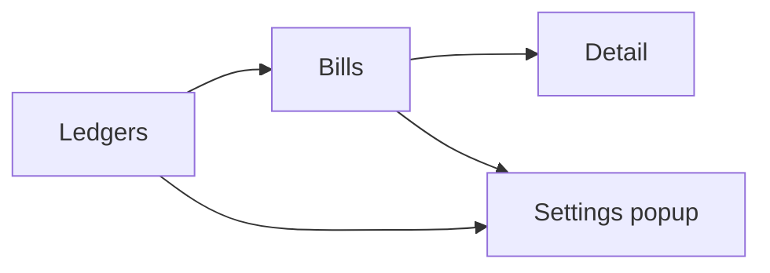

# Unbill UI

Shared UI model for all Unbill frontend implementations. Two implementations exist: `unbill-ui-leptos` (Tauri desktop, mouse-driven) and `unbill-tui` (terminal, keyboard-driven). Both follow the same screens, layout, and feature set. They differ only in input method and rendering technology.

## Navigation

- compact mode shows one screen at a time (desktop only, narrow windows)
- ranger mode shows three columns: ledgers, bills, and detail in adjacent columns
- the settings popup opens as a full-screen overlay in compact mode and as a floating overlay over the columns in ranger mode
- selection is page state: opening a ledger or bill editor changes the current context, not shared data

## Screens

### Ledgers

The ledgers screen is the entry point of the app. It lists ledgers available on the current device and provides the create-ledger action.

- renders typed ledger summaries from the backend
- sorts ledgers by latest bill timestamp descending, with empty ledgers after active ones and name order as the tie-breaker
- selecting a ledger changes page context only; it does not mutate shared state
- in ranger mode this screen remains visible as the first column

### Bills

The bills screen shows the effective bills for the selected ledger and the per-ledger settlement summary. It is the main entry into bill editing and ledger settings.

- renders effective bill DTOs rather than computing projection locally
- settlement is shown inline below the bill list: minimum transfers to clear the selected ledger's balances
- opens bill editing from the selected bill context
- opens the settings popup on the Ledger Settings tab with the current ledger pre-selected
- opening the settings popup keeps the bills screen visible behind the overlay
- using the back action clears the active ledger selection

### Detail

The detail screen is used for both create and amend flows. It edits one bill draft against the current ledger context.

- sends complete bill-save commands back through the bridge
- performs only local form logic such as amount parsing, share preview, and share-mode handling
- uses ledger users from the backend as the selectable bill participants
- new-bill mode seeds the draft from the current ledger users with equal shares
- amend mode seeds the draft from the selected bill and preserves its effective participant set
- payers and payees each have a share weight (positive integer); the editor shows a live per-participant amount so the user can verify the split before confirming
- does not own settlement, projection, or persistence rules

### Settings Popup

The settings popup is a single overlay with two tabs: Device Settings and Ledger Settings. It can be opened from two entry points, each of which controls which tab is active on open.

- opening from the device settings button or device settings keybinding opens the popup with the Device Settings tab active
- opening from a ledger (via ledger settings button or keybinding) opens the popup with the Ledger Settings tab active and that ledger pre-selected
- switching between tabs is always available within the popup
- in compact mode the popup occupies the full screen; in ranger mode it floats as an overlay over the columns

#### Device Settings Tab

The device settings tab owns local-only device concerns such as saved users, known peer devices, and join or import actions.

- shows the device ID (read-only)
- lists saved local users on this device; an add-saved-user action creates a new named user stored only on this device
- share-user action selects a saved user and generates an `unbill://user/…` URL to hand to another device; the URL is shown in a result overlay
- import-user action accepts an inbound `unbill://user/…` URL and fetches the user from the originating device, adding them to local saved users
- sync actions target known peer devices gathered from backend state
- join-ledger action accepts an inbound `unbill://join/…` URL to import a ledger from a peer device
- invitation URLs, device labels, and local saved users remain local client concerns
- this tab does not require an active ledger selection

#### Ledger Settings Tab

The ledger settings tab manages ledger-scoped users and the device invitation flow.

- shows a ledger selector listing all ledgers available on the device; the active ledger from context is pre-selected on open
- all actions in this tab apply to the currently selected ledger in the selector
- renders ledger users from the selected ledger
- add-user action lets the operator pick from device-local saved users to add to the selected ledger
- creates invitation URLs for the selected ledger only; keeps invitation output in popup state rather than shared ledger state

### Cross-Screen Behavior

- screens and popups render backend DTOs and send complete commands back through the bridge
- compact mode swaps the whole active screen, while ranger mode keeps selection visible across columns
- column one is always the ledgers view; column two is the bills view; column three is the detail view
- create-ledger, add-local-user, join-ledger, and add-user flows are overlays
- the settings popup is an overlay that sits above the column layout
- status, busy, and error feedback are shared across the app shell
- mutating actions refresh bootstrap state; ledger-scoped actions also refresh the selected ledger detail
