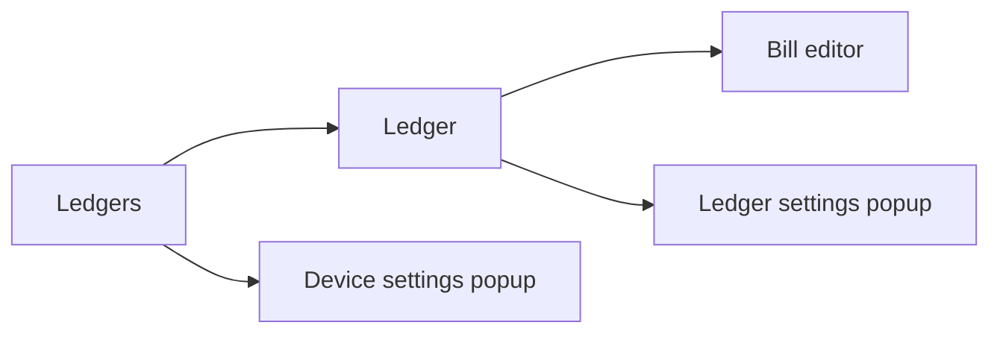

# Unbill UI

Shared UI model for all Unbill frontend implementations. Two implementations exist: `unbill-ui-leptos` (Tauri desktop, mouse-driven) and `unbill-tui` (terminal, keyboard-driven). Both follow the same screens, layout, and feature set. They differ only in input method and rendering technology.

## Navigation

- compact mode shows one screen at a time (desktop only, narrow windows)
- ranger mode shows three columns: ledgers, the active ledger, and the active bill editor in adjacent columns
- device settings and ledger settings open as popups over the current layout in both implementations
- selection is page state: opening a ledger or bill editor changes the current context, not shared data

## Screens

### Ledgers

The ledgers screen is the entry point of the app. It lists ledgers available on the current device and provides the create-ledger action.

- renders typed ledger summaries from the backend
- sorts ledgers by latest bill timestamp descending, with empty ledgers after active ones and name order as the tie-breaker
- selecting a ledger changes page context only; it does not mutate shared state
- in ranger mode this screen remains visible as the first column

### Ledger

The ledger screen shows the effective bills for the selected ledger and the per-ledger settlement summary. It is the main entry into bill editing and ledger settings.

- renders effective bill DTOs rather than computing projection locally
- settlement is shown inline below the bill list: minimum transfers to clear the selected ledger's balances
- opens bill editing from the selected bill context
- opening ledger settings popup keeps the ledger screen visible behind the overlay
- using the back action clears the active ledger selection

### Bill Editor

The bill editor is used for both create and amend flows. It edits one bill draft against the current ledger context.

- sends complete bill-save commands back through the bridge
- performs only local form logic such as amount parsing, share preview, and share-mode handling
- uses ledger users from the backend as the selectable bill participants
- new-bill mode seeds the draft from the current ledger users with equal shares
- amend mode seeds the draft from the selected bill and preserves its effective participant set
- payers and payees each have a share weight (positive integer); the editor shows a live per-participant amount so the user can verify the split before confirming
- does not own settlement, projection, or persistence rules

### Device Settings Popup

The device settings popup owns local-only device concerns such as saved users, known peer devices, and join or import actions.

- shows the device ID (read-only)
- lists saved local users on this device; an add-saved-user action creates a new named user stored only on this device
- sync actions target known peer devices gathered from backend state
- join-ledger action accepts an inbound `unbill://join/…` URL to import a ledger from a peer device
- invitation URLs, device labels, and local saved users remain local client concerns
- this popup does not require an active ledger selection

### Ledger Settings Popup

The ledger settings popup manages ledger-scoped users and the device invitation flow for the selected ledger.

- renders ledger users from the current ledger context
- add-user action lets the operator pick from device-local saved users to add to the ledger
- creates invitation URLs for the current ledger only; keeps invitation output in popup state rather than shared ledger state

### Cross-Screen Behavior

- screens and popups render backend DTOs and send complete commands back through the bridge
- compact mode swaps the whole active screen, while ranger mode keeps selection visible across columns
- column one is always the ledgers view; column two is the ledger view; column three is the bill editor
- create-ledger, add-local-user, join-ledger, and add-user flows are overlays rather than navigation contexts
- device settings and ledger settings are popups; they never replace a column
- status, busy, and error feedback are shared across the app shell rather than owned by one screen
- mutating actions refresh bootstrap state; ledger-scoped actions also refresh the selected ledger detail
