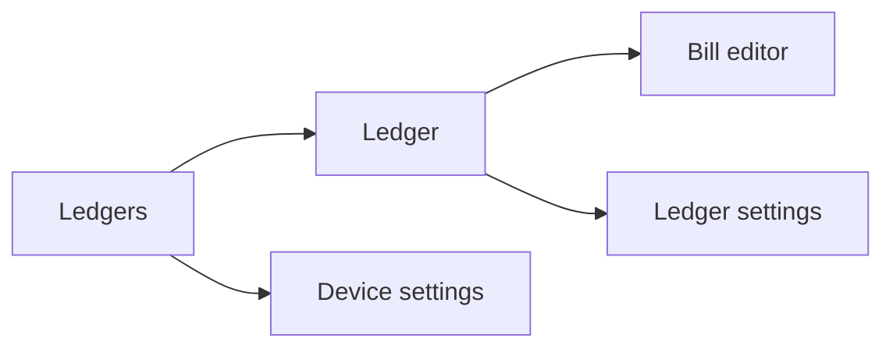

# unbill-ui-leptos

Shared Leptos UI for compact and desktop-style shells. The same page components drive both layouts.

## Navigation

- compact mode shows one page at a time
- ranger mode shows three columns: ledgers, the active ledger or device settings, and the active bill or ledger settings in adjacent columns
- selection is page state: opening a ledger, bill, or settings view changes the current context, not shared data

## Screens

### Ledgers

The ledgers screen is the entry point of the app. It lists ledgers available on the current device and provides the create-ledger action.

- renders typed ledger summaries from the backend
- sorts ledgers by latest bill timestamp descending, with empty ledgers after active ones and name order as the tie-breaker
- selecting a ledger changes page context only; it does not mutate shared state
- in ranger mode this screen remains visible as the first column

### Ledger

The ledger screen shows the effective bills for the selected ledger and is the main entry into bill editing and ledger settings.

- renders effective bill DTOs rather than computing projection locally
- opens bill editing from the selected bill context
- opening ledger settings keeps the selected ledger visible in the middle column in ranger mode
- using the back action clears the active ledger selection

### Bill Editor

The bill editor is used for both create and amend flows. It edits one bill draft against the current ledger context.

- sends complete bill-save commands back through the bridge
- performs only local form logic such as amount parsing, share preview, and share-mode handling
- uses ledger users from the backend as the selectable bill participants
- does not own settlement, projection, or persistence rules

### Device Settings

The device settings screen owns local-only device concerns such as saved users, known peer devices, and join or import actions.

- invitation URLs from clipboard, device labels, and local saved users remain local client concerns
- sync actions target known peer devices gathered from backend state
- opening device settings clears the third column in ranger mode
- this screen does not require an active ledger selection

### Ledger Settings

The ledger settings screen manages ledger-scoped users and the device invitation flow for the selected ledger.

- renders ledger users from the current ledger context
- creates invitation URLs for the current ledger only
- keeps invitation output in page state rather than shared ledger state
- in ranger mode it appears beside the selected ledger rather than replacing it

### Cross-Screen Behavior

- pages render backend DTOs and send complete commands back through the bridge
- compact mode swaps the whole active page, while ranger mode keeps selection visible across columns
