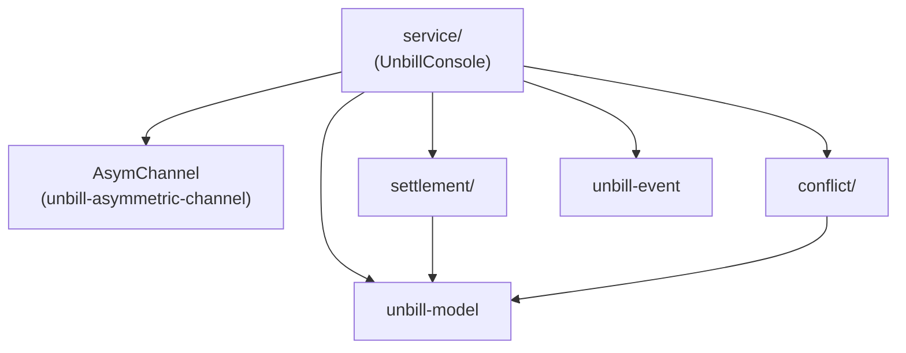

# unbill-console

The console-side library for unbill. It provides the CRDT document operations, settlement math, and conflict detection that every console (UI, TUI, CLI) uses to project ledger state for the user.

## Structure

`service/` is the public entry point. `UnbillConsole` drives an `AsymChannel` for all storage and device communication; it computes settlement and detects conflicts locally over the projected data. `settlement/` and `conflict/` are pure logic modules.

## Surface

`UnbillConsole` is the main entry point. It manages ledgers, users inside a ledger, bills, invitations, sync, settlement, conflict detection, and service events. All persistent operations are delegated to the `AsymChannel`; the console holds no durable ledger state of its own.

## Invariants

- IDs are typed newtypes and stay opaque outside the crate.
- Ledger currency is fixed at creation.
- Bills are append-only; amendment creates a new bill whose `prev` supersedes earlier bills.
- Bill participants must already exist in the ledger.
- Devices authorize sync per ledger and are not bound to specific users.
- A device enters `ledger.devices` in exactly two ways: the creating device is added automatically when the ledger is created; every subsequent device is added by the host during the join protocol. There is no removal.
- `add_device` is idempotent: adding the same `NodeId` twice is a no-op.
- Device labels, pending tokens, and saved users are local metadata rather than shared ledger state.

## Boundaries

- no CLI parsing, Tauri wiring, or UI state
- storage and transport are abstracted behind the `AsymChannel` trait
- ledger semantics, projection, and settlement stay in this crate
