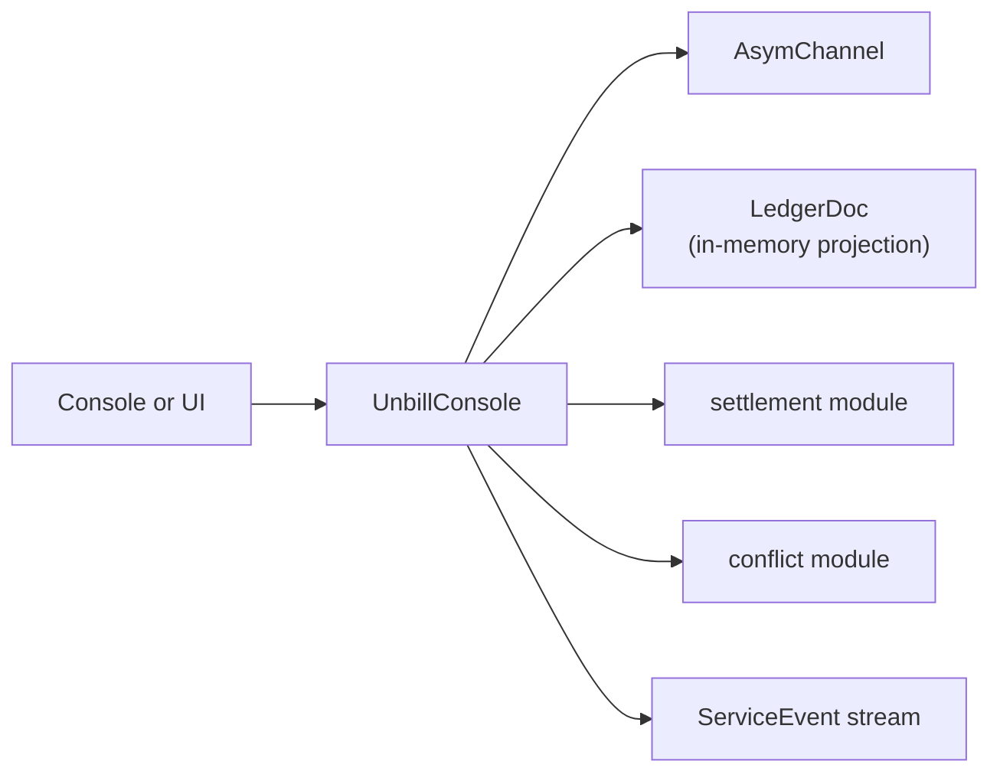

# service

The service module is the orchestration layer of unbill. It presents one async API for shells while keeping document logic, sync, and settlement behind a single boundary.

## Flow

## Responsibilities

- create, load, and mutate ledgers via the `AsymChannel`
- project in-memory `LedgerDoc` for bill and user queries
- create invitations and consume join flows
- coordinate sync and surface service events
- compute settlement across ledgers for one user
- detect amendment conflicts in the effective bill set

## Rules

- the service is the only public orchestration API of the core crate
- all persistent reads and writes go through the `AsymChannel`
- the service maintains an in-process `LedgerDoc` cache primed at startup and kept fresh on every write and on every `LedgerUpdated` event from the channel
- shells receive user-facing results and events, not direct access to persistence or Automerge
