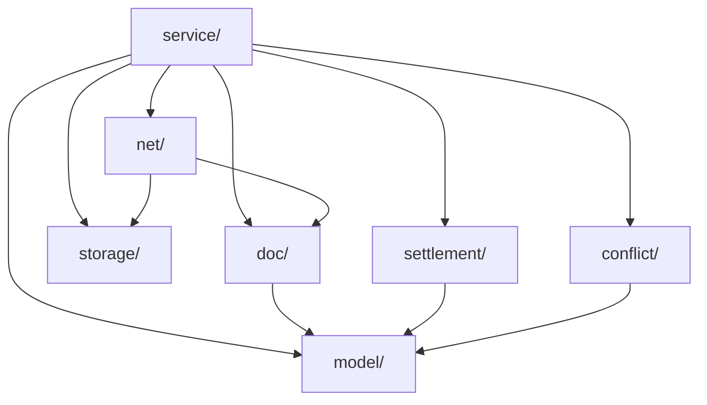

# Unbill Core

The core crate defines the shared ledger, persistence boundary, sync boundary, and settlement rules. Every frontend depends on it; none reimplement its domain logic.

## Structure

`service/` is the public entry point. The other modules are support layers that the service composes.

## Surface

`UnbillService` is the main entry point. It manages local users, ledgers, users inside a ledger, bills, invitations, sync, settlement, conflict detection, and service events.

## Invariants

- IDs are typed newtypes and stay opaque outside the core.
- Ledger currency is fixed at creation.
- Bills are append-only; amendment creates a new bill whose `prev` supersedes earlier bills.
- Bill participants must already exist in the ledger.
- Devices authorize sync per ledger and are not bound to specific users.
- Device labels, pending tokens, and saved users are local metadata rather than shared ledger state.

## Boundaries

- no CLI parsing, Tauri wiring, or UI state
- storage and transport are abstracted at the edges
- ledger semantics, projection, and settlement stay in this crate
