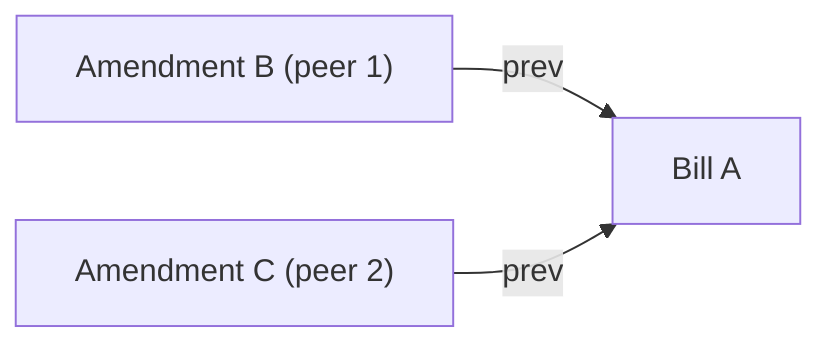

# conflict

The conflict module detects amendment conflicts in the effective bill set. A conflict exists when two or more effective bills share a common amendment ancestry but none supersedes the others.

## Why Conflicts Occur

Bills are append-only and amended by creating a successor with `prev` links to the bills being replaced. When two peers independently amend the same bill without knowledge of each other, both amendments become effective after sync. Neither names the other in `prev`, so neither supersedes the other. The result is a split history that the group must reconcile manually.

After sync, A is superseded. B and C are both effective and in conflict.

## Algorithm

Detection uses a Union-Find over all bill IDs, applied to the full bill list (not just effective bills).

1. Initialize each bill ID as its own component.
2. For each bill, union it with every ID in its `prev` list.
3. Collect the effective bill set.
4. Group effective bills by their Union-Find root.
5. Every group with two or more members is a `ConflictGroup`.

Bills outside any conflict group have exactly one effective bill in their component.

## Output

A `ConflictGroup` contains two sets of bills from the same Union-Find component:

- `conflicting` — the effective bills in the component; always two or more members
- `ancestors` — every non-effective bill in the same component; the full amendment history that led to the conflict

The service exposes conflict groups per ledger so shells can surface them to the user.

## Resolution

A conflict is resolved by creating a new amendment whose `prev` includes every effective bill in the group. That bill merges the competing branches into a single successor and the conflict group disappears from the next detection pass.
