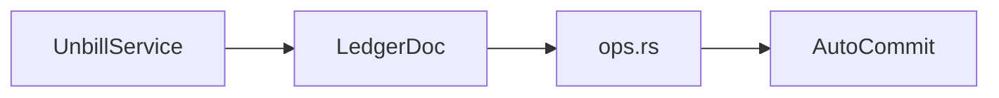

# doc

The doc module is the Automerge boundary. It turns the persisted ledger document into a typed in-memory object with a narrow set of read, write, and sync operations.

## Role

- own the `AutoCommit` document
- expose typed operations through `LedgerDoc`
- emit change events for local writes and applied remote changes
- keep raw Automerge manipulation out of service and UI layers

## Shape

`LedgerDoc` is the object-oriented wrapper. `ops.rs` holds the low-level document logic so it can be tested directly against `AutoCommit` without the service layer in the way.

## Rules

- reads return typed domain values
- writes reconcile a full typed ledger back into the document
- effective bills are a projection over stored bills, not a separate persisted table
