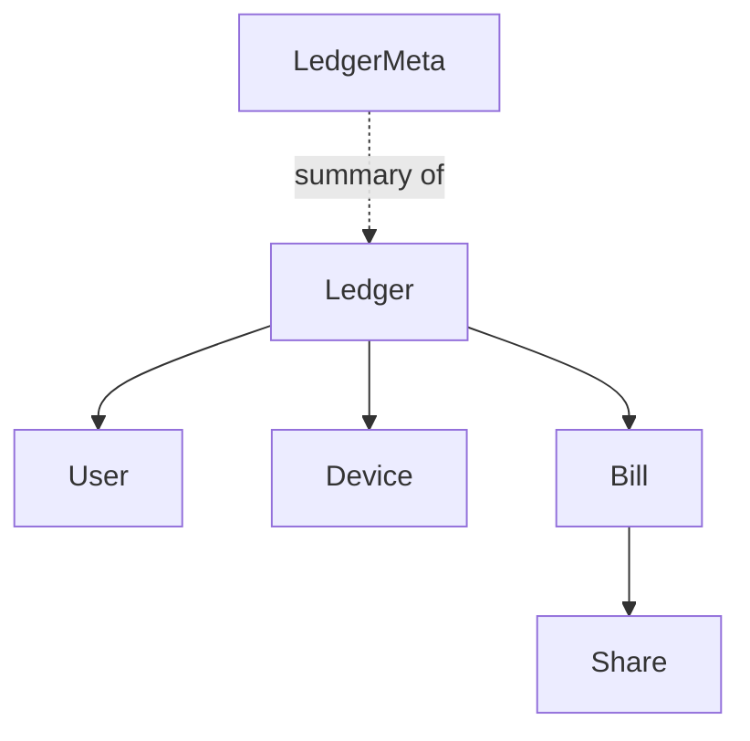

# model

The model module defines the shared vocabulary of unbill. It exists so every layer above it can talk in precise domain terms instead of raw strings and loosely typed maps.

## Concepts

- `Ledger` is the shared expense workspace
- `User` is a named person inside a ledger
- `Device` is an authorized sync peer inside a ledger
- `Bill` is an expense entry with payer, amount, weighted shares, and supersession links
- `LedgerMeta` is a lightweight summary used for listing ledgers without loading full snapshots
- `Invitation` and `InviteToken` are local coordination types for join and user-transfer flows

## Relationships

## Rules

- IDs are typed newtypes, not interchangeable strings
- users and devices are separate concepts
- bills are append-only and may supersede earlier bills through `prev`
- local coordination types are not part of the shared Automerge ledger unless the type is explicitly embedded in `Ledger`
