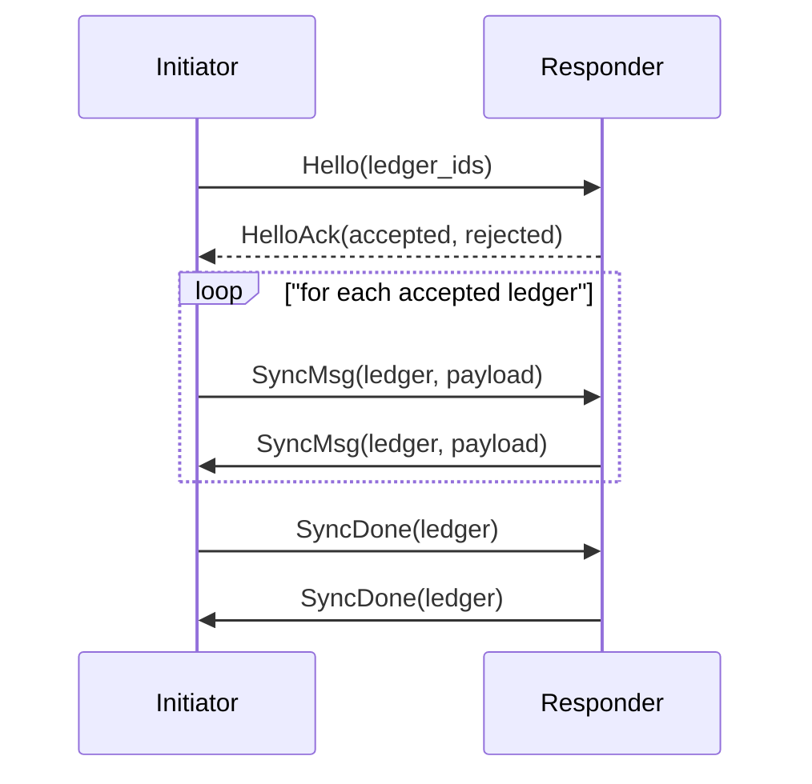
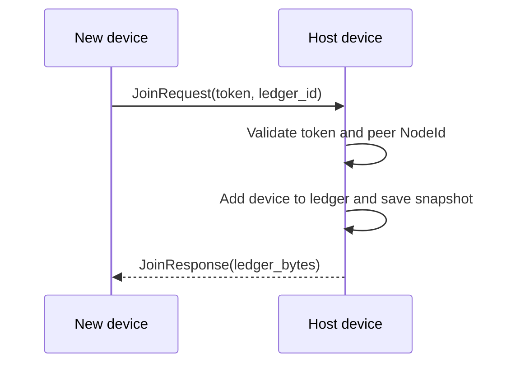
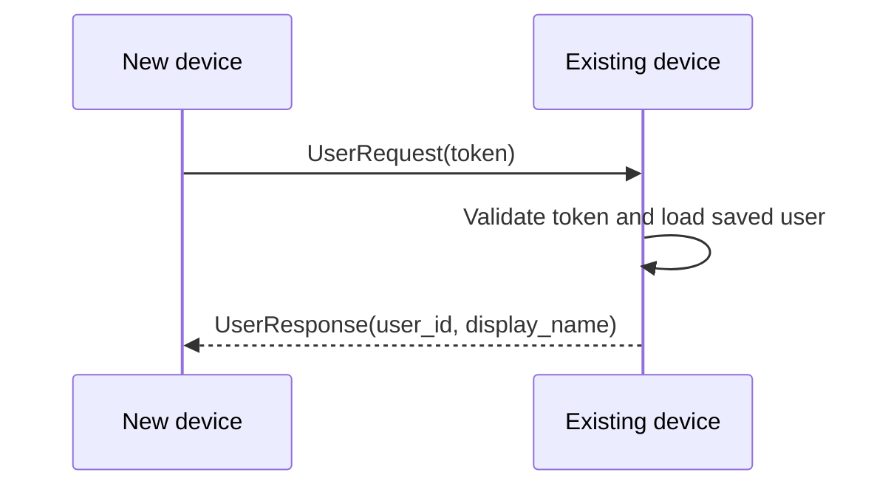

# net

Peer-to-peer transport for existing peers, device join, and saved-user transfer. All network I/O goes through Iroh, and each device is identified by its `NodeId`.

## Protocols

- `unbill/sync/v1` — authorized peers exchange ledger lists and Automerge sync messages
- `unbill/join/v1` — an invite token authorizes a new device, appends its `NodeId` to the ledger, and returns a full snapshot
- `unbill/user/v1` — one device transfers a saved user record to another device

## Flows

### Sync

### Device join

### Saved-user transfer

## Rules

- discovery comes from known `NodeId` values in ledgers or invite URLs
- authorization is ledger-scoped and based on the TLS-authenticated `NodeId`
- all protocols use length-prefixed CBOR framing
- sync state is session-local and not persisted between connections
- sync is user-initiated; there is no background polling or automatic reconciliation loop
- after remote changes are applied, the touched ledger is saved and the service emits `LedgerUpdated`
- join authorizes devices only; adding a named ledger user is a separate step
- device labels and pending tokens stay in local metadata, not shared ledger state

## Failure model

Unauthorized ledgers are rejected, invalid tokens fail join or user transfer, and transport errors surface to the service layer without creating a second source of truth.
