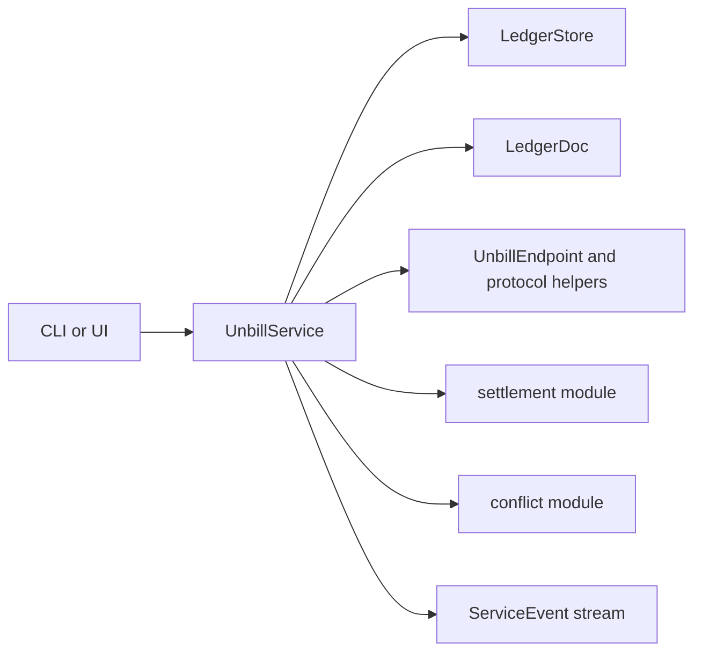

# service

The service module is the orchestration layer of unbill. It presents one async API for shells while keeping document logic, storage, sync, and settlement behind a single boundary.

## Flow

## Responsibilities

- create, load, and mutate ledgers
- manage local users and device labels
- create invitations and consume join or user-share flows
- coordinate sync and surface service events
- compute settlement across ledgers for one user
- detect amendment conflicts in the effective bill set

## Rules

- the service is the only public orchestration API of the core crate
- store-backed data is loaded on demand rather than mirrored in a long-lived cache
- shells receive user-facing results and events, not direct access to persistence or Automerge
