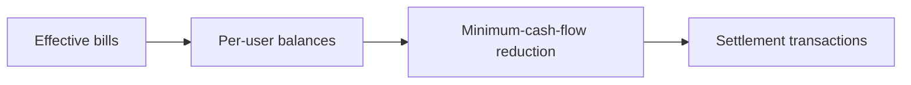

# settlement

The settlement module turns effective bills into net balances and then into a small set of suggested transfers.

## Model

## Rules

- all arithmetic is integer cents
- balances are accumulated from effective bills only
- the total of all balances must sum to zero
- share-weight rounding remainder is assigned in a stable order so every peer derives the same cent split
- the reduction step minimizes the number of transfers, not narrative fairness or payment ordering

Settlement is computed per user at the service layer by aggregating every ledger that contains that user, then filtering the reduced transaction set down to the transfers relevant to that user.
