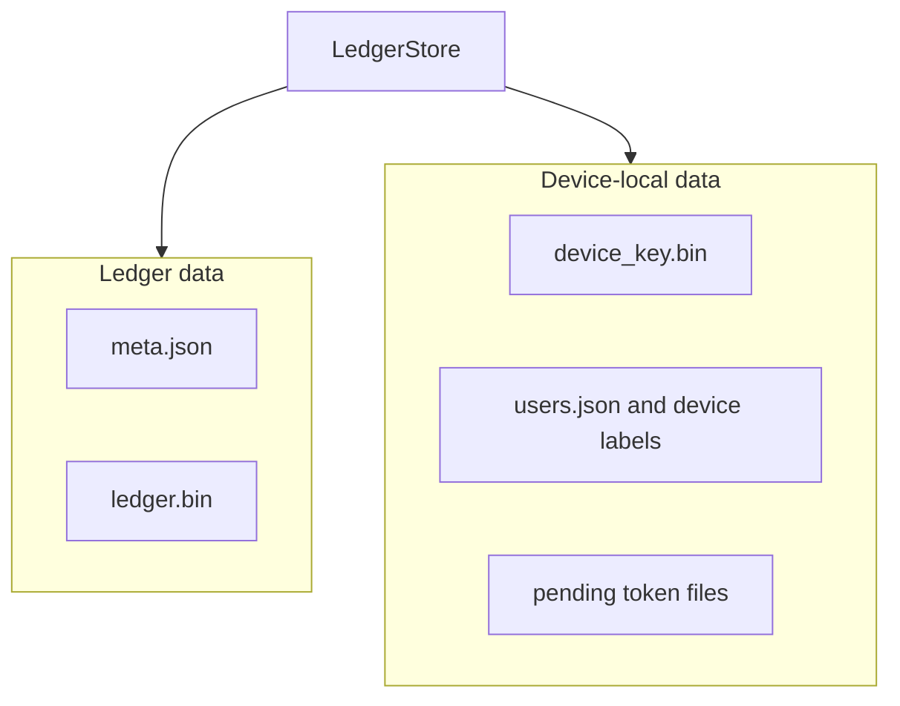

# storage

The storage module is the persistence boundary for unbill. It stores full ledger snapshots, lightweight ledger metadata, and device-local metadata without exposing filesystem details to higher layers.

## Contract

- `LedgerStore` loads and saves whole-ledger snapshots
- ledger metadata supports fast listing without hydrating Automerge bytes
- device-local metadata stores saved users, labels, and pending token state
- callers do not depend on path layout or file names directly

## Persistence View

## Rules

- shared ledger bytes and local metadata are stored separately
- the store is the only layer that knows how data is laid out on disk
- storage is whole-snapshot oriented rather than incremental append logging
