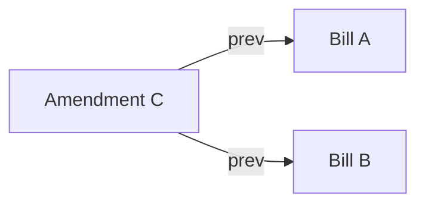

Bills are append-only.
A correction creates a new bill that points to one or more older bills through `prev`.
The older records remain in history.

The visible ledger is a projection over durable history.
It contains effective bills:
bills whose IDs are not referenced by another bill's `prev`.

One bill can replace one earlier bill.
One bill can also merge several earlier bills into a single successor.

This model avoids treating concurrent CRDT merge as business intent.
When peers independently amend the same bill,
both amendments may converge into the document,
but neither amendment necessarily represents the group's desired meaning.
The conflict becomes visible and must be resolved by a human choice.

A merge amendment resolves a conflict by naming every competing effective bill in `prev`.
The selected bill fields are preserved,
the competing branches become superseded,
and the next projection has one effective successor for that ancestry.

---

> **Sirno generated links begin. Do not edit this section.**

- belongs (to):
  - [unbill](unbill.md)
- belongs (from): (none)

> **Sirno generated links end.**
