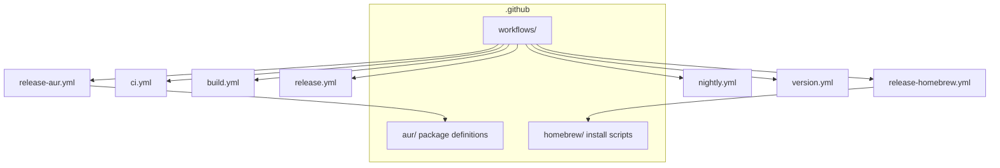
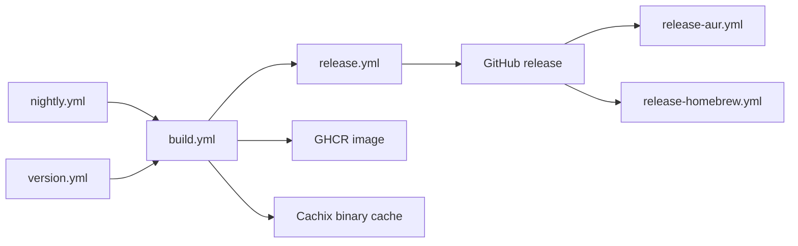

The CI/CD pipeline separates verification, artifact building, GitHub release publishing,
package-manager publishing, and image publishing.
Entry-point workflows are thin orchestrators.
Reusable workflows hold the build and release logic.

`ci.yml` runs on pushes to `main` and pull requests targeting `main`.
It sets warnings as errors.
It runs three parallel jobs:
lint through `prek run --all-files`,
Clippy for the workspace excluding `unbill-tauri`,
and tests for the workspace excluding `unbill-tauri`.

`build.yml` is reusable and also manually dispatchable.
It accepts a tag used for Docker image tagging.
It builds CLI, TUI, and daemon binaries for Linux x86_64,
macOS aarch64,
and Windows x86_64.
Each platform uses a target-specific Rust cache.
Artifacts use predictable names:
`unbill-cli-{platform}`,
`unbill-tui-{platform}`,
and `unbill-daemon-{platform}`,
with `.exe` kept on Windows.
Unix builds also produce `.tar.gz` archives per binary
(used by Homebrew formula generation).

The same build workflow builds Tauri desktop bundles for Linux,
macOS,
and Windows.
It checks out Git LFS,
installs Rust with the WASM target,
installs Linux GTK and WebKit dependencies on Linux,
installs Trunk,
installs the Tauri CLI,
runs the Tauri action for `crates/unbill-tauri`,
renames bundle outputs to `unbill-{platform}.{ext}`,
and uploads them as platform artifacts.

Mobile build jobs also live in `build.yml`.
The Android job installs Java,
the Android SDK,
the NDK,
Rust Android targets,
Trunk,
and Tauri CLI,
then initializes the Android project and uploads APK and AAB artifacts.
The iOS job installs the Rust iOS target,
Binaryen,
Trunk,
and Tauri CLI,
then initializes the iOS project and uploads an unsigned IPA.

The Nix job builds all flake packages (`unbill-cli`, `unbill-tui`, `unbill-daemon`, `unbill-tauri`)
and pushes them to the `unbill` Cachix binary cache.
Nix users who add `unbill.cachix.org` as a substituter
get pre-built binaries without local compilation.

The Docker job builds and pushes the server image to GHCR.
It tags the image with the workflow tag input and `latest`.

`release.yml` publishes a GitHub release from all `binaries-*` artifacts.
It marks releases as latest only when they are not prereleases.
AUR and Homebrew jobs depend on the GitHub release job (`needs: github`)
so that release assets exist before package managers attempt to download them.
It delegates package publishing to AUR and Homebrew workflows when their package arrays are non-empty.

`release-aur.yml` publishes one AUR package per matrix entry.
It derives `pkgver` from the tag by stripping a leading `v` and replacing hyphens with dots.
It resets `pkgrel` to 1,
then uses `jbouter/aur-releaser` with `AUR_SSH_KEY`.

The repository carries stable and nightly AUR package definitions for CLI,
TUI,
desktop,
and daemon packages.
Nightly packages provide and conflict with their stable counterparts.
Binary packages install raw release binaries into `/usr/bin`.
Desktop packages consume the Tauri-produced Debian bundle and declare GTK and WebKit runtime dependencies.

`release-homebrew.yml` publishes Homebrew formulae and an optional macOS Cask.
Formula jobs run sequentially (`max-parallel: 1`) to avoid push races on the tap.
Each formula job downloads the platform `.tar.gz` assets from the GitHub release,
computes SHA256 checksums,
generates a Ruby formula with per-platform `url`/`sha256` blocks,
and pushes it to `unbill-project/homebrew-tap` under `Formula/`.

When `cask: true` is passed,
a separate job (running after all formulas) downloads the macOS `.dmg`,
generates a Homebrew Cask under `Casks/unbill.rb`,
and pushes it to the tap.

The tap repository holds `Formula/` for CLI/TUI formulas
and `Casks/` for the desktop app.

`nightly.yml` runs at midnight UTC and by manual dispatch.
It creates a timestamp tag in the form `nightly-YYYYMMDD-HHMMSS`,
calls the reusable build workflow,
then publishes a prerelease targeting nightly AUR packages.

`version.yml` runs when a `v*` git tag is pushed.
It calls the reusable build workflow with the tag,
then publishes a stable release targeting stable AUR packages,
Homebrew formulae,
and the macOS Cask.

Versions are managed by `cargo release`.
`release.toml` disables crates.io publishing,
uses one shared workspace version,
and emits a single workspace tag `v{version}`.
Workspace crates inherit the version from `[workspace.package]` in `Cargo.toml`.

---

> **Sirno generated links begin. Do not edit this section.**

- core.belongs (to):
  - [distribution-and-release](distribution-and-release.md)
- core.belongs (from): (none)

> **Sirno generated links end.**
