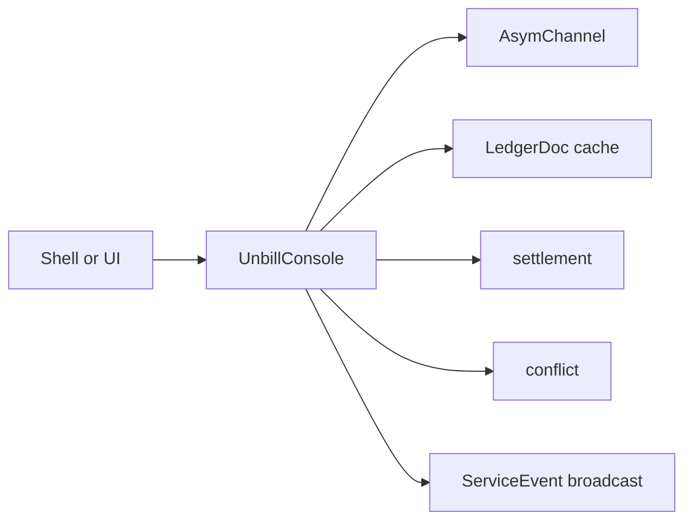

The console service is the public orchestration API for shells.
It creates, loads, and mutates ledgers through the asymmetric channel.
It projects in-memory `LedgerDoc` values for bill and user queries.
It creates invitations,
consumes join flows,
coordinates sync,
computes settlement,
detects conflicts,
and surfaces service events.

Opening the service is async.
It primes a mutex-protected map of `LedgerId` to `LedgerDoc`
by syncing every known ledger once.
It then starts an event bridge task that re-syncs the affected ledger
whenever the channel reports `LedgerUpdated`
and re-emits `ServiceEvent::LedgerUpdated` on the console's own broadcast sender
so that subscribing shells and UIs receive the notification.

Most public methods take the target document out of the cache,
perform one typed mutation or query,
sync the document back to the device when mutated,
and return the document to the cache.
Read-only operations also take and put the document so cache ownership stays explicit.

Shells receive user-facing results and events.
They do not receive direct persistence or raw Automerge handles.

---

> **Sirno generated links begin. Do not edit this section.**

- belongs (to):
  - [unbill-console](unbill-console.md)
- belongs (from): (none)

> **Sirno generated links end.**
