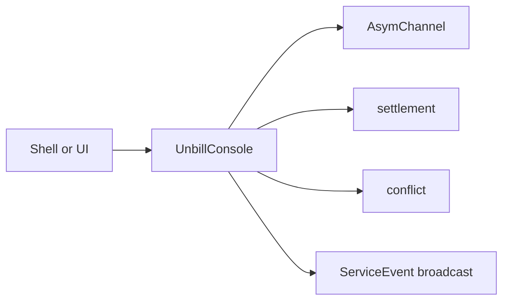

The console service is the public orchestration API for shells.
It creates, loads, and mutates ledgers through the asymmetric channel.
It creates invitations,
consumes join flows,
coordinates sync,
computes settlement,
detects conflicts,
and surfaces service events.

The console does not cache ledger documents.
Every read or mutation loads a fresh `LedgerDoc` from the device
via `sync_doc` and discards it after use.
This keeps the console stateless and avoids stale-cache race conditions
between peer sync and subsequent reads.

Opening the service starts an event bridge task
that translates `AsymChannelEvent::LedgerUpdated` from the channel
into `ServiceEvent::LedgerUpdated` on the console's own broadcast sender
so that subscribing shells and UIs receive the notification.

Shells receive user-facing results and events.
They do not receive direct persistence or raw Automerge handles.

---

> **Sirno generated links begin. Do not edit this section.**

- belongs (to):
  - [unbill-console](unbill-console.md)
- belongs (from): (none)

> **Sirno generated links end.**
