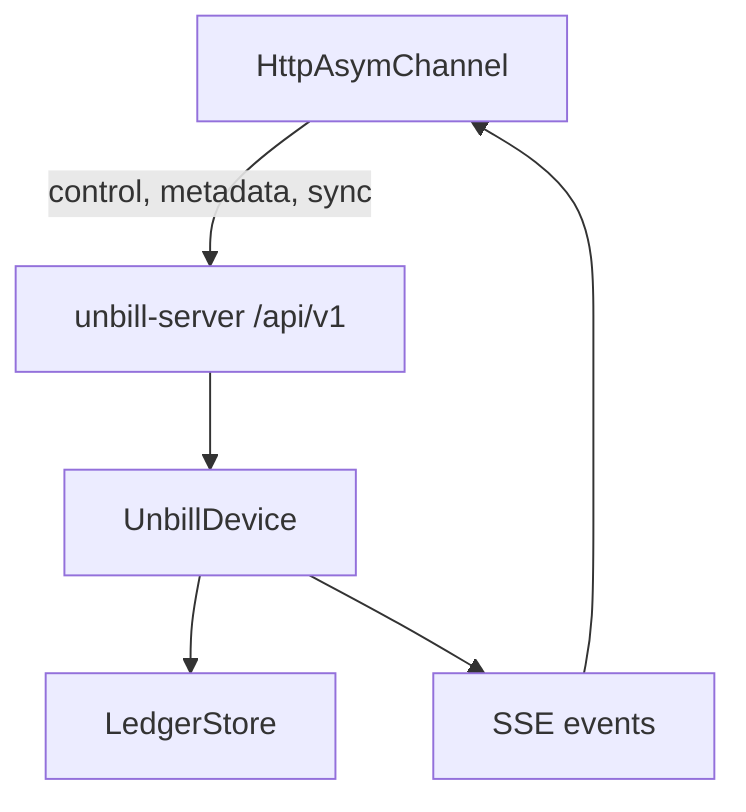

The HTTP API is authenticated with `Authorization: Bearer <api_key>`.
The server mounts the protected API under `/api/v1`.

Ledger endpoints list ledgers,
write ledger metadata,
exchange binary Automerge sync messages,
create invitations,
and join ledgers from invitation URLs.

Peer endpoints trigger one-shot sync to a known peer `NodeId`.

Device endpoints expose the current device ID
and read or write device metadata blobs under validated keys.

The events endpoint streams server-sent events.
`LedgerUpdated` events are serialized as JSON data fields.
Other event fields are ignored by the HTTP client,
and clients reconnect after connection errors or clean close.

The route surface is:
`GET /ledgers`,
`PUT /ledgers/{id}/meta`,
`POST /ledgers/{id}/sync`,
`POST /ledgers/{id}/invitations`,
`POST /ledgers/join`,
`POST /peers/{node_id}/sync`,
`GET /device/id`,
`GET /device/{key}`,
`PUT /device/{key}`,
and `GET /events`.

`POST /ledgers/{id}/sync` is the data-plane endpoint.
The client sends Automerge sync message bytes.
The server receives them into its document,
generates a response message when available,
saves when the document changed,
and returns either response bytes or no content.

The server rejects unparseable sync bodies as bad requests.
It maps unauthorized tokens to unauthorized responses.
Device metadata lookup returns absence rather than error for missing keys.
Other non-success statuses map to storage or channel errors on the client side.

---

> **Sirno generated links begin. Do not edit this section.**

- belongs (to):
  - [asymmetric-channel](asymmetric-channel.md)
  - [unbill-server](unbill-server.md)
- belongs (from): (none)

> **Sirno generated links end.**
