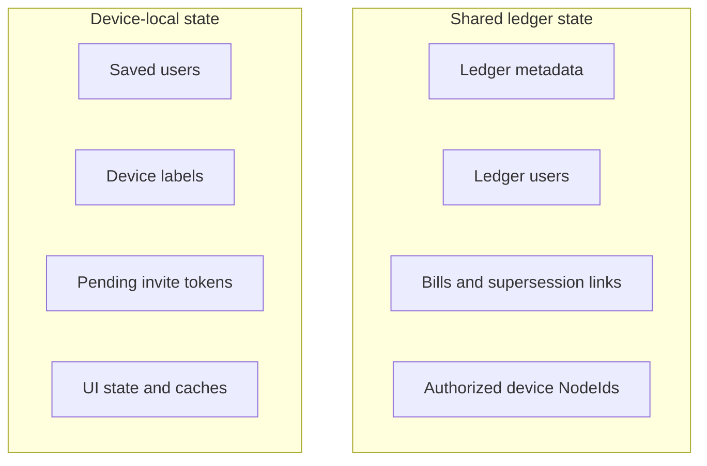

Shared state is the minimum durable record peers need to agree on a ledger.
It includes ledger metadata, ledger users, bills, supersession links,
and authorized device `NodeId` values.

Local state makes one device usable.
It includes saved users, device labels, pending invitation tokens,
UI state, caches, and other machine-specific metadata.

Shared and local state are stored separately.
Peers converge only on shared ledger data.
They do not converge on personal labels, saved user conveniences, clipboard contents,
or transient UI state.

Device labels and pending invitations are local metadata.
Invitation URLs and copied invitation text are local client concerns.

---

> **Sirno generated links begin. Do not edit this section.**

- belongs (to):
  - [unbill](unbill.md)
- belongs (from): (none)

> **Sirno generated links end.**
