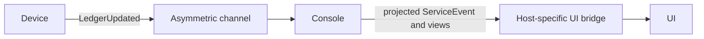

Sync is user-initiated.
There is no background polling loop or automatic reconciliation loop by default.
A user or integration explicitly requests a sync round.

Device-to-device sync happens through the symmetric channel.
Peers exchange ledger lists,
authorize accepted ledgers by device membership,
run Automerge sync messages for those ledgers,
save touched documents,
and disconnect.

Device-to-console sync happens through the asymmetric channel.
The console sends one Automerge sync message per request,
and the device responds with its own sync message or no message when it has nothing new.

After remote changes are applied and saved,
the store emits `LedgerUpdated`.
The device forwards that fact through the asymmetric channel.
The console responds by pulling a fresh sync round.

UI layers receive materialized service events and projected views.
CRDT details are absorbed by the console library before reaching frontend components.

---

> **Sirno generated links begin. Do not edit this section.**

- belongs (to):
  - [channels](channels.md)
  - [unbill](unbill.md)
- belongs (from): (none)

> **Sirno generated links end.**
