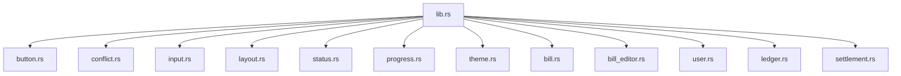

`unbill-ui-components` contains reusable pure Leptos components.
It imports no Tauri, no HTTP transport, and no domain crates.

Operations that touch external state are callback props.
The caller wires those callbacks to Tauri, HTTP, mocks, or tests.
Components own only local UI state such as expansion,
hover,
validation feedback,
and pending spinners.

Component prop and event data types are plain structs defined in this crate.

The crate exports buttons, icon buttons, list rows, tag pills,
settings navigation items, settings navigation groups,
currency input,
screen frames,
pages,
safe-area containers,
empty columns,
section cards,
field blocks,
modal sheets,
bottom sheets,
status strips,
bill views,
bill editor,
user views,
ledger views,
settlement views,
conflict panels,
and theme picker.

`ScreenFrame` is the outer container for a full-height screen column.
The caller may supply a header fragment with leading, copy, and trailing flex children.
When no header is supplied, no topbar is rendered.
An optional footer prop renders a sticky footer below the scroll content.

`SectionCard` groups form fields or list items under a title,
with only a separator between header and body.
An optional kicker prop renders a small uppercase label above the title.
`EmptyColumn` renders a short centered message without a decorative wrapper.

`Page` wraps children in a top-level page container.
`SafeAreaContainer` wraps children in a safe-area-aware container
for device notch and home-indicator insets.
`Sheet` is a bottom-sheet drawer overlay.
It takes a reactive open signal and a close callback
and animates in and out via CSS transitions on a wrapper element.

`button.rs` also exports `SettingsNavItem` and `SettingsNavGroup`.
`SettingsNavItem` renders a sidebar navigation button with a label and trailing chevron.
`SettingsNavGroup` renders a titled group of navigation items.

`bill_editor.rs` owns the shared bill editor draft model.
Custom share weights stay as raw text until submission.
Preview parsing is tolerant and supports simple addition and subtraction expressions.
The save-request builder performs strict amount,
participant,
and share-weight validation.

`conflict.rs` owns the reusable conflict group panel.
Apps map backend DTOs to display items.
The component stores only selected bill ID and emits the selected bill ID
with the full competing bill ID set on commit.

## Color system and theming

All colors in the component stylesheet are CSS custom properties.
Each app stylesheet defines light and dark palettes grouped as
surface, text, line, and semantic accent variables.

The dark palette uses a blue-tinted slate base.
By default the active palette follows `prefers-color-scheme`.
A three-way theme picker (Light / System / Dark) in the General settings tab
lets the user override the system preference.
The choice is persisted in local storage and applied before the first render.

`theme.rs` owns the theme model, persistence, and picker component.

Pure helpers are unit-tested directly.
Component rendering is covered by consuming frontend crates.

---

> **Sirno generated links begin. Do not edit this section.**

- belongs (to):
  - [frontend-ui](frontend-ui.md)
  - [workspace-layout](workspace-layout.md)
- belongs (from): (none)

> **Sirno generated links end.**
