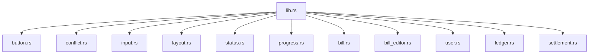

`unbill-ui-components` contains reusable pure Leptos components.
It imports no Tauri, no HTTP transport, and no domain crates.

Operations that touch external state are callback props.
The caller wires those callbacks to Tauri, HTTP, mocks, or tests.
Components own only local UI state such as expansion,
hover,
validation feedback,
and pending spinners.

Component prop and event data types are plain structs defined in this crate.

The crate exports buttons, icon buttons, list rows, tag pills,
currency input,
screen frames,
empty columns,
section cards,
field blocks,
modal sheets,
status strips,
bill views,
bill editor,
user views,
ledger views,
settlement views,
and conflict panels.

`ScreenFrame` is the outer container for a full-height screen column.
The caller may supply a header fragment with leading, copy, and trailing flex children.
When no header is supplied, no topbar is rendered.

`SectionCard` groups form fields or list items under a title,
with only a separator between header and body.
`EmptyColumn` renders a short centered message without a decorative wrapper.

`bill_editor.rs` owns the shared bill editor draft model.
Custom share weights stay as raw text until submission.
Preview parsing is tolerant and supports simple addition and subtraction expressions.
The save-request builder performs strict amount,
participant,
and share-weight validation.

`conflict.rs` owns the reusable conflict group panel.
Apps map backend DTOs to display items.
The component stores only selected bill ID and emits the selected bill ID
with the full competing bill ID set on commit.

## Color system

All colors in the component stylesheet use CSS custom properties.
No hardcoded hex or rgba values appear in component rules.
The app stylesheets define the full palette in `:root`
and override it under `@media (prefers-color-scheme: dark)`.

The palette has three groups:

- **Surface and background** — `--bg-app`, `--bg-surface`, `--bg-subtle`, `--bg-muted`,
  `--bg-accent`, `--bg-accent-soft`, `--bg-warning`, `--bg-error`.
- **Lines and text** — `--line-soft`, `--line-strong`,
  `--text-strong`, `--text-body`, `--text-soft`, `--text-inverse`.
- **Semantic accents** — `--accent-border`, `--accent-selected`, `--accent-text`,
  `--accent-secondary-border`, `--warning-border`, `--error-text`, `--error-border`,
  `--overlay-hover`, `--overlay-active`, `--overlay-backdrop`, `--focus-ring`,
  `--toast-info-bg`, `--toast-info-text`, `--toast-error-bg`, `--toast-error-text`,
  `--shadow-overlay`.

Dark mode uses a blue-tinted slate palette (`#0f172a` base).
By default the theme follows `prefers-color-scheme`.
Users can override this to always-light or always-dark
through a three-way theme picker (Light / System / Dark)
in the General settings tab.

`theme.rs` owns `ThemeMode`, `load_theme`, `apply_theme`, and `ThemePicker`.
The preference is persisted in `localStorage` under `unbill-theme`
and applied by setting a `data-theme` attribute on the `<html>` element.
Both app `main.rs` files call `apply_theme(load_theme())` at startup
so the saved preference takes effect before the first render.

CSS resolution:
- No `data-theme` attribute → follows `prefers-color-scheme` (system default).
- `data-theme="dark"` → forces dark palette regardless of system preference.
- `data-theme="light"` → forces light palette regardless of system preference.

`color-scheme: light dark` is set by default so browser-native controls
(scrollbars, form elements) also adapt.
The `data-theme` overrides set `color-scheme` to `light` or `dark` explicitly.

Pure helpers are unit-tested directly.
Component rendering is covered by consuming frontend crates.

---

> **Sirno generated links begin. Do not edit this section.**

- belongs (to):
  - [frontend-ui](frontend-ui.md)
  - [workspace-layout](workspace-layout.md)
- belongs (from): (none)

> **Sirno generated links end.**
