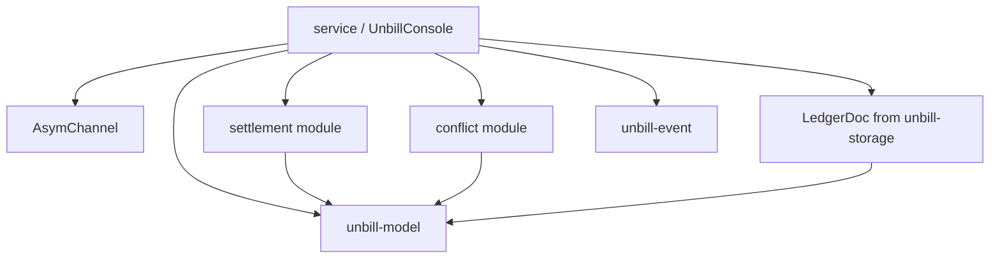

`unbill-console` is the console-side library.
It drives an `AsymChannel`,
keeps an in-process ledger projection,
computes settlement,
detects amendment conflicts,
and exposes user-facing service results.

`service/` is the public entry point through `UnbillConsole`.
Persistent operations are delegated to the asymmetric channel.
The console holds no durable ledger state of its own.

`settlement/` and `conflict/` are pure logic modules.
They operate over projected ledger state.

The crate preserves core invariants:
IDs stay typed and opaque,
ledger currency is fixed at creation,
bills are append-only,
bill participants must already exist in the ledger,
devices authorize sync per ledger,
device addition is idempotent,
and local metadata remains outside shared ledger state.

The crate does not own CLI parsing, Tauri wiring, or UI state.
Storage and transport are abstracted behind the asymmetric channel.

---

> **Sirno generated links begin. Do not edit this section.**

- belongs (to):
  - [workspace-layout](workspace-layout.md)
- belongs (from):
  - [conflict-detection](conflict-detection.md)
  - [console-reexports](console-reexports.md)
  - [console-service](console-service.md)
  - [ledger-doc](ledger-doc.md)
  - [settlement](settlement.md)

> **Sirno generated links end.**
