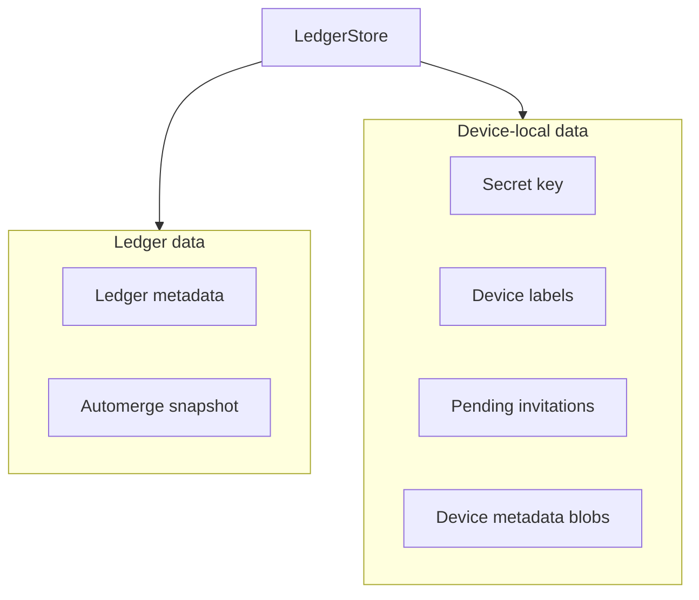

`unbill-storage` defines the persistence boundary.
It stores whole-ledger Automerge snapshots,
lightweight ledger metadata,
and device-local metadata.

`LedgerStore` loads and saves ledgers as `LedgerDoc`.
Ledger metadata supports fast listing without hydrating Automerge bytes.
Device-local storage covers labels,
pending invitations,
the secret key,
and arbitrary key-addressed metadata blobs exposed by the store trait.

`save_ledger` takes a mutable document.
A store may merge remote changes back into that document before returning,
so the caller must treat the document as the authoritative merged state after a successful save.

Every successful `save_ledger` emits `ServiceEvent::LedgerUpdated`,
regardless of whether the write came from a local operation, remote sync, or join.
`subscribe()` returns a broadcast receiver for those events.

`get_secret_key` returns `StorageError::Unauthorized` for stores that cannot expose raw key material.

Modules:
`store` defines the trait and result alias.
`doc` wraps Automerge in `LedgerDoc`.
`ops` contains low-level Automerge map and list operations.
`device_meta` provides typed JSON helpers over well-known device metadata keys.

Store implementations live in separate crates.
`LedgerDoc` and `ops` are unit-tested in place,
while store implementations test the shared contract in their own crates.

---

> **Sirno generated links begin. Do not edit this section.**

- belongs (to):
  - [storage](storage.md)
  - [workspace-layout](workspace-layout.md)
- belongs (from): (none)

> **Sirno generated links end.**
