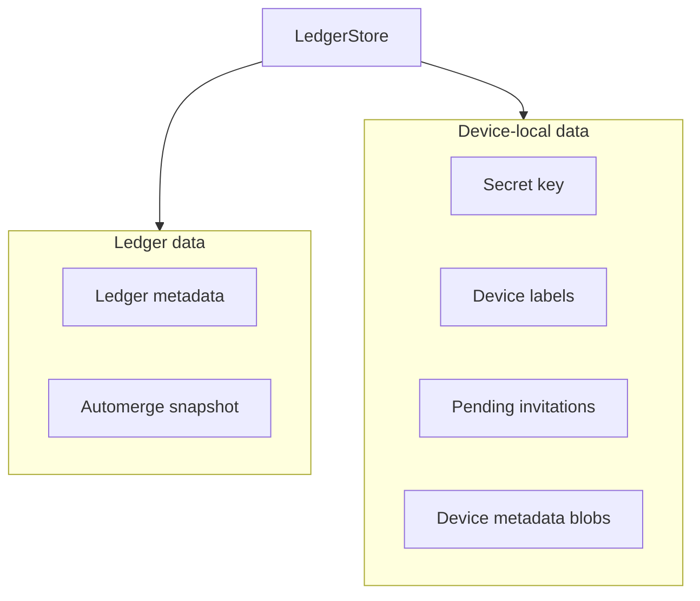

`unbill-storage` defines the persistence boundary.
It stores whole-ledger Automerge snapshots,
lightweight ledger metadata,
and device-local metadata.

`LedgerStore` loads and saves ledgers as `LedgerDoc`.
Ledger metadata supports fast listing without hydrating Automerge bytes.
Device-local storage covers labels,
pending invitations,
the secret key,
and arbitrary key-addressed metadata blobs exposed by the store trait.

`save_ledger` takes a mutable document.
A store may merge remote changes back into that document before returning,
so the caller must treat the document as the authoritative merged state after a successful save.

Every successful `save_ledger` emits `ServiceEvent::LedgerUpdated`,
regardless of whether the write came from a local operation, remote sync, or join.
`subscribe()` returns a broadcast receiver for those events.

`get_secret_key` returns `StorageError::Unauthorized` for stores that cannot expose raw key material.

Modules:
`store` defines the trait and result alias.
`device_meta` provides typed JSON helpers over well-known device metadata keys.
`store_server` provides the MPSC actor (native targets only).

`LedgerDoc` and `ops` live in `unbill-model`,
not here — only `unbill-device` should depend on `unbill-storage`.
The `LedgerStore` trait references `LedgerDoc` from `unbill-model`.

Store implementations live in separate crates.
Store implementations test the shared contract in their own crates.

## StoreServer

`StoreServer` serializes all store access through an MPSC channel.
A single background tokio task owns the raw `dyn LedgerStore`
and processes commands sequentially.
`StoreServer` does NOT implement `LedgerStore` —
no component other than the internal consumer ever holds a raw store reference.
The type system enforces this: functions that need store access
take `&StoreServer`, not `&dyn LedgerStore`.

Individual operations (list, load, save) and compound operations
(asym_sync, create_invitation, consume_invitation, add_device_to_ledger,
merge_and_save_ledger, persist_joined_ledger, collect_peers)
are all public methods on `StoreServer`.
Compound operations execute as single MPSC commands,
guaranteeing atomicity for read-modify-write sequences.

`merge_and_save_ledger` handles the sync session save phase:
it atomically loads the current stored version,
merges the synced document via `LedgerDoc::merge`,
and saves the combined result.
This prevents concurrent operations from overwriting each other.

### Concurrency guarantees

All store mutations are serialized through the single MPSC consumer.
Compound operations are atomic — no other command can interleave
between the load and save of a read-modify-write sequence.

Read-only sequences that span multiple MPSC commands
(e.g. `collect_peers` listing then loading each ledger,
or the sync session hello phase checking authorization per ledger)
are individually serialized but not batch-atomic.
This is acceptable because the results are used for best-effort discovery or gating
and self-heal on the next cycle.
The current system has no device deauthorization,
so the authorization check in the sync hello phase cannot go stale
between the check and the subsequent doc load.

Concurrent `trigger_peer_sync` calls for the same peer are safe:
both sync sessions `merge_and_save_ledger` at the end,
and automerge merge is commutative and idempotent.

### Error handling

`StorageError::ChannelClosed` is the discriminable variant
for StoreServer actor communication failures
(MPSC send or oneshot receive failing because the consumer task stopped).
Dropped reply sends (caller cancelled before receiving the result)
are logged at `warn` level.
Broadcast event sends with no subscribers log at `warn` and stop forwarding.

---

> **Sirno generated links begin. Do not edit this section.**

- belongs (to):
  - [storage](storage.md)
  - [workspace-layout](workspace-layout.md)
- belongs (from):
  - [store-server](store-server.md)

> **Sirno generated links end.**
