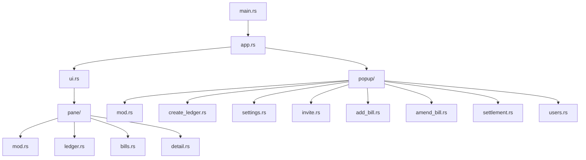

`unbill-tui` is a keyboard-driven terminal frontend.
It follows the shared UI model but is always a three-column layout.
There is no compact mode and no mouse support.

Rendering uses Ratatui on a Crossterm backend.
The TUI connects to a running `unbill-daemon` through `RpcAsymChannel`
and opens `UnbillConsole` over that channel.

One pane is focused at a time.
The active pane has a highlighted border.
Navigation keys move focus left and right,
cycle focus,
move the cursor inside a pane,
and jump to first or last item.

Actions are context-sensitive.
The ledgers pane creates or deletes ledgers and opens device settings.
The bills pane adds or amends bills and opens ledger settings.
The detail pane starts or amends bill editing.
Quit and escape behavior apply consistently.
The status bar shows only valid keys for the focused pane,
or close hints when a popup is open.

Popup navigation follows the same vertical movement conventions as panes.
Tab and reverse tab move between form fields.
Enter confirms.
Escape closes without action.

Implementation layout:
`main.rs` initializes tracing,
connects to the daemon socket,
enters alternate screen raw terminal mode,
and runs the app.
`app.rs` owns state, event loop, and key routing.
`ui.rs` renders the top-level layout.
`pane` modules render ledgers, bills, detail, and bill editing.
`popup` modules implement popup views and actions.

The event loop selects across terminal events,
service events,
and a 16 ms render tick.
Key events go first to an active popup,
then to the bill editor when the detail pane is focused,
then to the focused pane.

The bill editor has description, amount, payers, and payees sections.
It validates and calls service bill-save behavior only when confirming the final section.

The TUI has no unit tests of its own.
Domain correctness is covered by shared crates,
and the TUI is validated manually against the same service exercised by CLI e2e tests.

---

> **Sirno generated links begin. Do not edit this section.**

- core.belongs (to):
  - [applications](applications.md)
  - [frontend-ui](frontend-ui.md)
- core.belongs (from): (none)

> **Sirno generated links end.**
